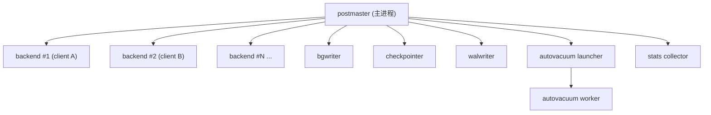
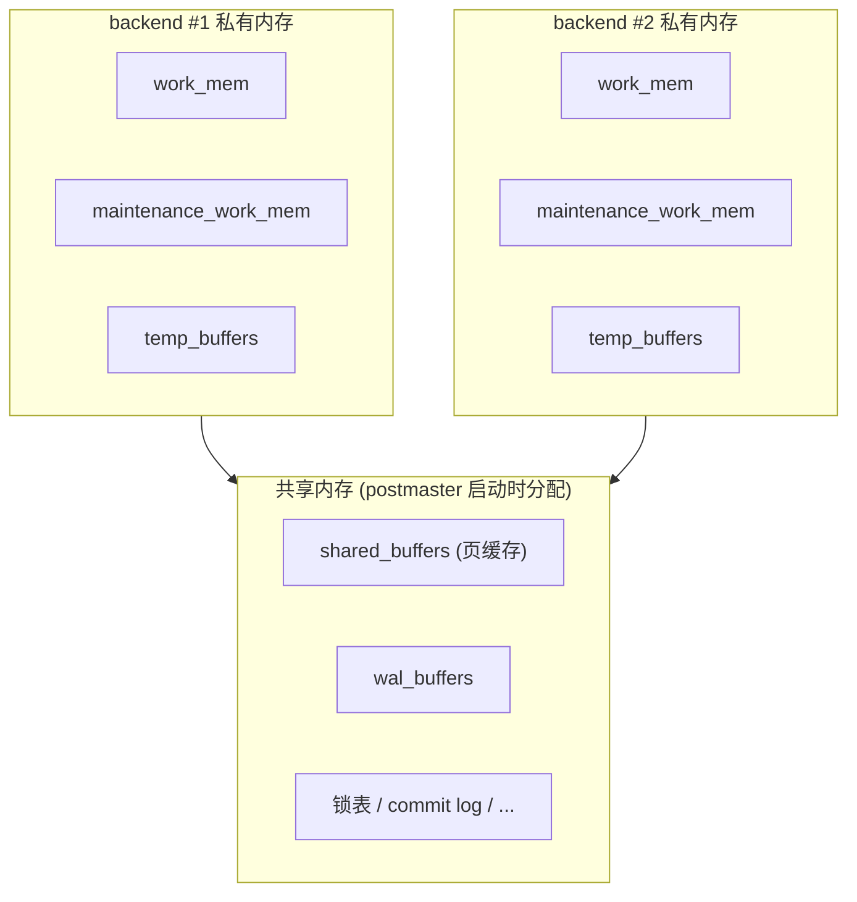
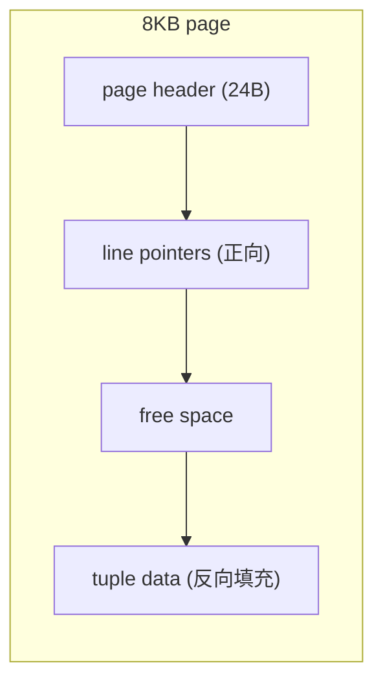

# PostgreSQL 体系结构

PostgreSQL 是一个**多进程**数据库系统：主进程 postmaster 监听端口、按需 fork 出 backend 进程为每个客户端连接服务，另有一组后台辅助进程负责脏页落盘、WAL 写入、自动 VACUUM 等。所有进程通过**共享内存**协作，主要状态（页缓存、WAL 缓冲、锁表）住在共享内存里。修改先写 WAL 再改数据页，崩溃后靠重放 WAL 恢复。本章只看「进程、内存、文件、系统列、WAL」这五个层面的可观察证据，复制 / 配置调优 / 备份分别留到后续章节。

本模块在 `m_architecture` schema 下预置了一张 `probe(id serial PK, val text NOT NULL)` 表，5 行——只是为了让 `pg_relation_filepath` 和系统列 example 有东西可看。

## 1. 进程模型 — postmaster + backend + 后台

PG 是一个**多进程**架构，不是多线程。**postmaster** 是主进程，负责监听端口、接受连接、按需 fork 出一个 **backend** 进程为该连接服务——一个连接对应一个进程，连接关闭进程退出。另有一组常驻的**后台辅助进程**：`bgwriter`（异步刷脏页）、`checkpointer`（检查点）、`walwriter`（刷 WAL）、`autovacuum launcher` 及其 worker、`stats collector` 等。进程模型决定了 PG 单连接代价较高，生产环境需要连接池（→ ch21）。

### 语法骨架

```text
postmaster                       # 主进程
├── backend × N                  # 每个客户端连接一个
├── background writer            # 异步刷脏页
├── checkpointer                 # 周期性 checkpoint
├── walwriter                    # 刷 WAL buffer 到 WAL 文件
├── autovacuum launcher          # 调度自动 VACUUM
│   └── autovacuum worker × M    # 实际执行 VACUUM
└── stats collector / logger ... # 统计 / 日志收集
```

- **postmaster**：监听端口、accept、fork 子进程；不直接处理 SQL
- **backend**：实际执行 SQL 的进程，生命周期 = 连接生命周期
- **后台辅助进程**：随 postmaster 启动停止，与所有 backend 共享同一块共享内存
- 进程间通过**共享内存**协作，不靠线程



:::example{id="list-backend-procs"}

:::example{id="version-info"}

## 2. 内存结构 — 共享内存 + 进程私有内存

PG 的内存分两层。**共享内存**全局一份，所有进程可见：核心是 `shared_buffers`（页缓存，命中后无需读磁盘）+ `wal_buffers`（WAL 写出前的缓冲区）+ 锁表 + 其他子系统。**进程私有内存**每个 backend 自己一份：`work_mem`（单次排序 / 哈希操作的内存上限，一个查询可能用多份）、`maintenance_work_mem`（VACUUM / CREATE INDEX 等维护操作）、`temp_buffers`（临时表的缓冲）。`effective_cache_size` 是 planner 估算磁盘缓存大小用的参数，**不会真的分配**这么多内存。

### 语法骨架

```text
共享内存（postmaster 启动时一次性分配）
  shared_buffers          页缓存（默认 128MB，生产常设为内存 25%）
  wal_buffers             WAL 缓冲（默认 shared_buffers/32）
  锁表 / 提交日志 / 其他

每个 backend 私有
  work_mem                排序 / 哈希 / 物化的内存上限
  maintenance_work_mem    VACUUM / CREATE INDEX / ALTER TABLE 等
  temp_buffers            会话内临时表缓冲

planner 提示（非分配）
  effective_cache_size    告诉 planner "操作系统大约缓存了多少"
```

- `shared_buffers`：所有 backend 共用的页缓存，hit 率是核心指标
- `work_mem`：**每个操作**一份，复杂查询 × 高并发会放大成 `work_mem × 并发 × 操作数`
- `maintenance_work_mem`：单次维护操作的内存上限，比 `work_mem` 大很多
- `effective_cache_size`：**估算值**，影响 planner 选 index scan 还是 seq scan，不分配内存



:::example{id="show-memory-params"}

## 3. 存储布局 — page、文件、TOAST

每张表在磁盘上是一个或多个 **8KB page**（也叫 block）组成的物理文件，存放在数据目录 `$PGDATA/base/<dboid>/` 下，以 relation 的 `relfilenode` 数字命名。文件超过 1GB 会切分成多段（`<oid>`、`<oid>.1`、`<oid>.2`…）。每张表还伴生 **FSM**（free space map，记录每个 page 还有多少可用空间）和 **VM**（visibility map，标记哪些 page 全可见、可跳过 VACUUM）。单行超过约 2KB 时，大值会被拆出来存进一张独立的 **TOAST 表**，主表只留指针——这套机制叫 The Oversized-Attribute Storage Technique。

### 语法骨架

```text
$PGDATA/
├── base/<dboid>/
│   ├── <relfilenode>           # 表的主数据文件（8KB page × N）
│   ├── <relfilenode>_fsm       # free space map
│   ├── <relfilenode>_vm        # visibility map
│   ├── <toast-oid>             # 大值的 TOAST 表
│   └── ...
├── pg_wal/                     # WAL 文件目录
└── ...

8KB page 内部
┌─────────────────────────────┐
│ page header (24B)           │
├─────────────────────────────┤
│ line pointers → → →         │  正向增长
│ ...                         │
│           (free space)      │
│ ...                         │
│           ← ← ← tuple data  │  反向增长
└─────────────────────────────┘
```

- `relfilenode`：物理文件名，与 `oid` 一般相同但**不等于**（`VACUUM FULL` / `CLUSTER` 会换 `relfilenode`）
- **page**：固定 8KB（编译期常量），是 PG 读写磁盘的最小单位
- **line pointer**：page 头部的小数组，每项指向 page 内某个 tuple 的偏移
- **TOAST**：大字段自动外存，对用户透明
- `pg_relation_filepath(name)`：拿到 relation 对应的相对路径



:::example{id="relation-filepath"}

:::example{id="table-toast-and-size"}

## 4. 系统列 — 每行自带的元数据

每张表的每一行都隐式带着几个**系统列**，`SELECT *` 不会带出，必须显式写出列名才看得到。常用的六个：`tableoid`（这行属于哪张表，跨继承 / 分区时区分）、`oid`（行级 oid，大多数表不再有）、`xmin`（插入这行版本的事务 id）、`xmax`（删除 / 锁定这行版本的事务 id，活跃为 0）、`cmin` / `cmax`（同事务内的命令序号），以及 `ctid`（行的物理位置 `(block, offset)`）。`xmin` / `xmax` 是 MVCC 的可见性判断基础（→ ch11），`ctid` 是物理地址、`UPDATE` 后会变。

### 语法骨架

```text
SELECT
  tableoid,    -- 行所属表的 oid（regclass 可读化）
  xmin,        -- 创建该版本的事务 id
  xmax,        -- 删除/锁定该版本的事务 id（活跃 = 0）
  cmin, cmax,  -- 同事务内的命令序号
  ctid,        -- 行的物理位置 (block, offset)
  <user-columns>
FROM <table>;
```

- 系统列只能**显式**写，`SELECT *` 不带它们
- `tableoid::regclass` 转成可读表名
- `ctid` 形如 `(0,1)`，第 0 个 block 第 1 个 line pointer
- `xmin` / `xmax` 是 `xid` 类型，可以和 `txid_current()` 等函数对比

:::example{id="inspect-system-columns"}

## 5. WAL — 写前日志

**WAL**（Write-Ahead Log，写前日志）是 PG 持久化与崩溃恢复的核心机制：任何对数据页的修改，**先**把变更记录追加到 WAL 文件，**再**改内存里的数据页（数据页随后由 bgwriter / checkpointer 异步落盘）。崩溃后只需从最近一次检查点开始重放 WAL，就能把数据恢复到一致状态。WAL 同时是流复制和 PITR 的输入（→ ch22 / ch24）。WAL 写入位置叫 **LSN**（Log Sequence Number），单调递增，对应 `pg_wal/` 下的 16MB 段文件。

### 语法骨架

```text
事务执行修改
   │
   ▼
backend 改 shared_buffers 里的页（标脏）+ 写 WAL 记录到 wal_buffers
   │
   ▼ COMMIT 时
walwriter / backend fsync wal_buffers → pg_wal/<segment>
   │
   ▼ 周期性（checkpoint_timeout / max_wal_size 触发）
checkpointer 把所有脏页刷到数据文件，标记 WAL 可回收
```

- **先 WAL 再数据**：写操作返回前 WAL 必须 fsync，数据页可以晚一点落
- **checkpoint**：把检查点之前的所有脏页刷盘，之后早于该点的 WAL 可丢弃
- **LSN**：WAL 字节级位置，形如 `0/16B3A98`，全局单调递增
- `pg_current_wal_lsn()`：当前 WAL 写入位置；`pg_walfile_name(lsn)`：该 LSN 落在哪个段文件


:::example{id="wal-current-lsn"}

:::example{id="wal-related-params"}
