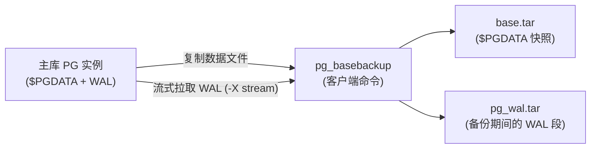
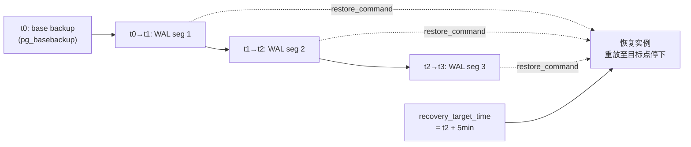

# 备份与恢复

PG 的备份分两条路径：**逻辑备份**（pg_dump / COPY，把数据导成 SQL 或 CSV）和**物理备份**（pg_basebackup，复制整个数据目录）。配合 **WAL 归档**就能做到 **PITR**（point-in-time recovery，恢复到任意时间点）。本章介绍这些工具的形态、各自适用的场景，以及恢复时的关键参数。

`pg_dump` / `pg_restore` / `pg_basebackup` 都是**操作系统命令行工具**，不在 SQL 连接里执行。本模块的 example 只展示 SQL 层能跑的部分（COPY 等价 SELECT、归档相关 GUC 查询、`pg_export_snapshot()`），命令行工具用语法骨架 + 文字解释展示。

本模块在 `m_backup_restore` schema 下预置了一张 `orders` 表（100 行）。

## 1. 逻辑备份 — pg_dump / pg_restore / COPY

`pg_dump` 把单个数据库导出为 SQL 脚本或自定义格式归档文件，适合迁移、小库备份、跨大版本搬迁。`pg_restore` 读自定义格式归档把库还原回来。SQL 层内置的 `COPY ... TO/FROM` 是批量导入导出单表数据的快通道，比逐行 INSERT 快得多。逻辑备份的输出是「SQL 或文本数据」，可读、跨平台、跨大版本，但恢复需要重放，大库会慢。

### 语法骨架

```text
# 导出整个库到自定义格式归档
pg_dump -Fc -d <db> -f <out.dump>

# 从自定义格式归档恢复
pg_restore -d <db> <out.dump>

# SQL 层批量导出 / 导入单表
COPY <table> TO   STDOUT WITH (FORMAT csv [, HEADER true]);
COPY <table> FROM STDIN  WITH (FORMAT csv [, HEADER true]);
```

- `-Fc`：自定义格式（custom），可被 `pg_restore` 并行恢复、按对象筛选
- `-d <db>`：源 / 目标数据库名
- `-f <out>`：输出文件路径
- `COPY ... TO STDOUT`：把查询结果以流式格式写到客户端（psql 用 `\copy`）
- `FORMAT`：`csv` / `text` / `binary`；`HEADER true` 给 CSV 加表头行

:::example{id="inspect-orders"}

:::example{id="copy-to-stdout"}

:::example{id="copy-format-comparison"}

## 2. 物理备份 — pg_basebackup

`pg_basebackup` 把整个 `$PGDATA` 目录（含必要的 WAL）复制到目标位置，输出是「另一个可启动的 PG 实例」。它通过流复制协议连主库，比 pg_dump 快、能配合 WAL 归档做 PITR，但只能在**完全相同**的大版本之间恢复，且备份粒度是整个集群（cluster），不能只备某个库。典型用途：搭物理备库、做 PITR 的基线、整集群迁移。

### 语法骨架

```text
pg_basebackup -h <host> -U <repl-user> -D <target-dir> -Ft -X stream -P
```

- `-h <host>` / `-U <repl-user>`：连接主库的地址和具备 replication 权限的角色
- `-D <target-dir>`：备份输出目录（必须为空）
- `-Ft`：tar 格式输出（base.tar + pg_wal.tar）；`-Fp` 则直接铺成目录
- `-X stream`：备份过程中同步流式拉取 WAL，保证一致性
- `-P`：显示进度



:::example{id="pgdata-location"}

## 3. WAL 归档与 PITR

打开 `archive_mode = on` 并配置 `archive_command`，PG 会把写满的 WAL 段拷贝到指定位置（远程目录 / 对象存储等）。**一份基线物理备份** + **从备份点之后的 WAL 归档**就能把数据库恢复到任意时间点，这就是 PITR。恢复时把基线还原到新实例，建一个 `recovery.signal` 文件，并在 `postgresql.conf` 里配 `restore_command` 和 `recovery_target_time`，PG 启动后会重放 WAL 直到目标时间点，然后停下并允许写入。PG 12+ 已不再用 `recovery.conf`，所有参数都在 `postgresql.conf` 里设。

### 语法骨架

```text
# postgresql.conf 主库：开启归档并把 WAL 段拷到远程
archive_mode    = on
archive_command = 'cp %p /archive/%f'

# postgresql.conf 恢复实例：拉归档 + 指定恢复目标时间
restore_command       = 'cp /archive/%f %p'
recovery_target_time  = '2025-05-12 14:30:00+08'
```

- `archive_mode`：`off` / `on` / `always`（备库也归档）
- `archive_command`：shell 命令模板，`%p` = WAL 段源路径，`%f` = 文件名；返回 0 表示成功
- `restore_command`：恢复实例从归档拉 WAL 段时执行的命令，参数同上
- `recovery_target_time`：恢复目标时间戳；也可用 `recovery_target_lsn` / `recovery_target_xid` / `recovery_target_name`



:::example{id="show-archive-params"}

:::example{id="current-wal-position"}

## 4. 快照与一致性导出

`pg_export_snapshot()` 把当前事务的快照 ID 导出，另一个连接在它的事务开头执行 `SET TRANSACTION SNAPSHOT '<id>'` 就能看到完全相同的数据视图。这正是 `pg_dump -j` 并行导出时多 worker 看到一致数据的机制：主 worker 在 REPEATABLE READ 事务里导出快照 ID，各 sub-worker 导入这个快照后并行拉数据。快照只在主事务存活期间有效。

### 语法骨架

```text
-- 连接 A，处在事务中：
SELECT pg_export_snapshot();
-- 返回类似 '00000003-00000099-1'

-- 连接 B，事务开头：
BEGIN ISOLATION LEVEL REPEATABLE READ;
SET TRANSACTION SNAPSHOT '00000003-00000099-1';
-- 之后的查询看到的就是连接 A 导出快照时的数据视图
```

- `pg_export_snapshot()`：必须在显式事务里调用，返回字符串型快照 ID
- `SET TRANSACTION SNAPSHOT`：必须在事务的**第一条**语句、隔离级别 `REPEATABLE READ` 或 `SERIALIZABLE`
- 导出连接的事务结束（COMMIT/ROLLBACK）后，该快照失效

:::example{id="export-snapshot"}

## 5. 第三方备份工具（点到为止）

社区主流的第三方工具是 **pgBackRest** 和 **Barman**，两者都基于 `pg_basebackup` + WAL 归档机制，但补足了原生工具缺的能力：增量 / 差异备份、并行传输、远端对象存储（S3）、自动保留策略、PITR 模板化。大库（>100 GB）或合规要求严格的环境一般直接用它们而不是手搓 pg_basebackup + 脚本。本课程不展开使用，但你需要知道它们存在以及解决的问题域。

### 语法骨架

```text
# pgBackRest：配置文件驱动，命令分 stanza
pgbackrest --stanza=<name> backup            # 增量/差异/全量按策略
pgbackrest --stanza=<name> restore           # 还原 + 自动写 recovery 配置

# Barman：远端服务器集中管控多套 PG 集群的备份
barman backup <server-name>
barman recover <server-name> <backup-id> <target-dir>
```

- 两者都跑在 OS 层（命令行 + 守护进程），不是 PG 扩展
- 都支持 PITR、远端归档、备份保留策略
- 选型经验：单库环境 pgBackRest 更轻；多套集群集中管理 Barman

:::example{id="available-extensions-note"}
