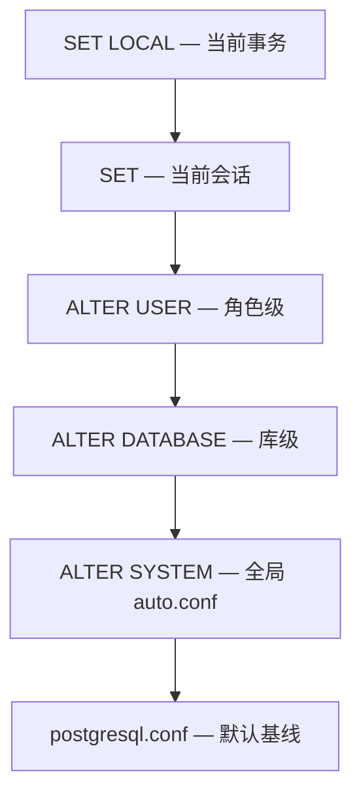
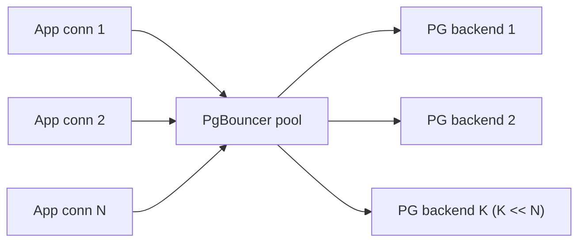

# 配置与调优

PostgreSQL 的运行参数从主配置文件 `postgresql.conf` 起步，还可以在 5 个层级里覆盖：系统级 `ALTER SYSTEM`、数据库级、用户级、会话级、事务级。本章只读默认值、用 `SET LOCAL` 在当前事务里改，**不**碰物理配置文件。

本模块在 `m_config_tuning` schema 下预置了一张 `probe` 表（5 行），后续 example 用它做最小验证基底。

## 1. 参数从哪里来

参数解析按层级覆盖：`postgresql.conf` 是默认基线，`ALTER SYSTEM SET` 把改动写入 `postgresql.auto.conf`（需 reload 或重启生效），`ALTER DATABASE ... SET` 绑定到某个库，`ALTER USER ... SET` 绑定到某个角色，会话内 `SET` 改本连接的剩余生命周期，事务内 `SET LOCAL` 只活到 COMMIT/ROLLBACK。同名参数按这条链「上层覆盖下层」。`pg_settings` 视图的 `source` 字段告诉你当前值来自哪一层。

### 语法骨架

```text
ALTER SYSTEM   SET <name> = <value>;   -- 全局，写入 postgresql.auto.conf
ALTER DATABASE <db>   SET <name> = <value>;
ALTER USER     <role> SET <name> = <value>;
SET            <name> = <value>;       -- 当前会话剩余生命周期
SET LOCAL      <name> = <value>;       -- 仅当前事务

-- 优先级（高 → 低）：
-- SET LOCAL > SET > ALTER USER > ALTER DATABASE > ALTER SYSTEM > postgresql.conf
```

- `<name>`：参数名，如 `work_mem` / `random_page_cost` / `statement_timeout`
- `<value>`：字符串字面量或合法数值；带单位的写 `'32MB'` / `'100ms'`
- `SHOW <name>`：读当前生效值
- `SELECT current_setting('<name>')`：函数形式，可嵌入查询表达式
- `pg_settings`：系统视图，能看到 `setting`、`unit`、`source`、`sourcefile` 等元信息



:::example{id="show-vs-current-setting"}

:::example{id="set-local-effect"}

:::example{id="pg-settings-source"}

## 2. 内存类参数

PG 的内存参数分两类：进程间共享和单查询临时。`shared_buffers` 是 PG 自己管理的页缓存，经验值取主机 RAM 的 25% 左右。`work_mem` 是单个 sort / hash 操作能用的上限，**每个连接每个操作各算一份**——所以乘上连接数才是潜在峰值。`maintenance_work_mem` 给 VACUUM、CREATE INDEX 这类维护性操作用，可以比 `work_mem` 大很多。`effective_cache_size` 不分配内存，只是告诉 planner「OS page cache + shared_buffers 大概有多大」，让它估算索引扫描的命中率。

### 语法骨架

```text
shared_buffers        -- PG 共享缓存大小（启动时分配，重启才生效）
work_mem              -- 单 sort/hash 操作内存上限
maintenance_work_mem  -- VACUUM / CREATE INDEX 等维护操作的内存上限
effective_cache_size  -- planner 估算可用 OS cache + shared_buffers 总和（不实际分配）
```

- 所有 4 个参数的值都带字节单位：`'128MB'` / `'4GB'`
- 只有 `work_mem` 和 `maintenance_work_mem` 能 `SET LOCAL` 调整，其余需重启或 reload
- `pg_settings.unit` 告诉你单位是 `8kB`（页数）、`kB`、`MB` 还是其他

:::example{id="show-all-memory-params"}

## 3. Planner cost 参数

PG 的 planner 用一组「成本常数」给每个候选执行计划估分，选总成本最低的那一个。`seq_page_cost`（默认 1）是顺序读一页的代价，`random_page_cost`（默认 4）是随机读一页的代价——4 是机械硬盘时代留下的比例，SSD 上常调到 `1.1`。`cpu_tuple_cost`、`cpu_index_tuple_cost`、`cpu_operator_cost` 分别是处理一行、处理一个索引行、调用一个操作符的 CPU 代价。`random_page_cost` 偏高时 planner 倾向 Seq Scan，偏低时倾向 Index Scan。

### 语法骨架

```text
seq_page_cost          -- 顺序读一页的代价，默认 1
random_page_cost       -- 随机读一页的代价，默认 4，SSD 常调到 1.1
cpu_tuple_cost         -- 处理一行的 CPU 代价
cpu_index_tuple_cost   -- 处理一个索引行的 CPU 代价
cpu_operator_cost      -- 调用一个操作符 / 函数的 CPU 代价
```

- 所有 5 个参数都是无量纲的相对比例，单位是「读一页顺序数据 = 1」
- 都可以 `SET LOCAL` 临时改，常用于 ad-hoc 调试 planner 选择
- 改了之后用 `EXPLAIN` 看计划是否切换

:::example{id="show-cost-params"}

:::example{id="set-local-random-page-cost"}

## 4. 连接相关

PG 用进程模型，每个客户端连接对应一个独立的 postgres 进程，连接本身有固定内存开销（约 10MB 起）。`max_connections` 是全局上限，调高会同时放大 `work_mem` 的峰值估算。`idle_in_transaction_session_timeout` 在事务开着但客户端不动时主动断开，避免长事务把 vacuum 卡住。`statement_timeout` 给单条 SQL 设上限，超时后服务端报错 `57014 (query_canceled)` 取消执行。

### 语法骨架

```text
max_connections                       -- 整个实例允许的并发连接上限（重启生效）
superuser_reserved_connections        -- 给超级用户预留的额外槽位
idle_in_transaction_session_timeout   -- 事务空闲超时（防止长事务）
statement_timeout                     -- 单条 SQL 超时
```

- `max_connections` 不能用 `SET LOCAL` 改，只能重启
- 后三个都能 `SET LOCAL`，用毫秒数或带单位字符串 `'100ms'` / `'2s'` / `'0'`（0 = 不超时）
- `statement_timeout` 触发后 SQLSTATE 是 `57014`

:::example{id="show-connection-params"}

:::example{id="set-local-statement-timeout"}

## 5. 连接池（PgBouncer 点到为止）

PG 的「每连接一进程」模型让物理连接昂贵——握手、内存、进程切换都不便宜。生产环境通常在应用与 PG 之间放一个 **PgBouncer**：客户端连 PgBouncer 走轻量协议，PgBouncer 在后端维护一小批长连接复用。PgBouncer 有三种 pool mode：`session`（一个客户端连接独占一个后端连接直到客户端断开）、`transaction`（每个事务用完归还）、`statement`（每条语句归还）。`transaction` 模式最常见，但不能用 `prepared statement` 或会话级状态（包括 `SET`、临时表）。

### 语法骨架

```text
pool_mode    复用粒度                    限制
─────────    ───────────────────────    ──────────────────────────────
session      客户端断开才归还             无；几乎等价于直连
transaction  每个事务结束就归还           不能用 prepared statement / 会话变量 / 临时表
statement    每条语句结束就归还           最严格；不能用任何跨语句状态（含事务）
```

- 教学环境不演示 PgBouncer 部署，知道这三种 mode 的取舍即可
- 选 `transaction` 时应用端要禁用 prepared statement 缓存（驱动通常有开关）
- PgBouncer 不替代连接池库，它是「在 PG 进程外」再做一层池化



:::example{id="client-side-pool-comparison"}
