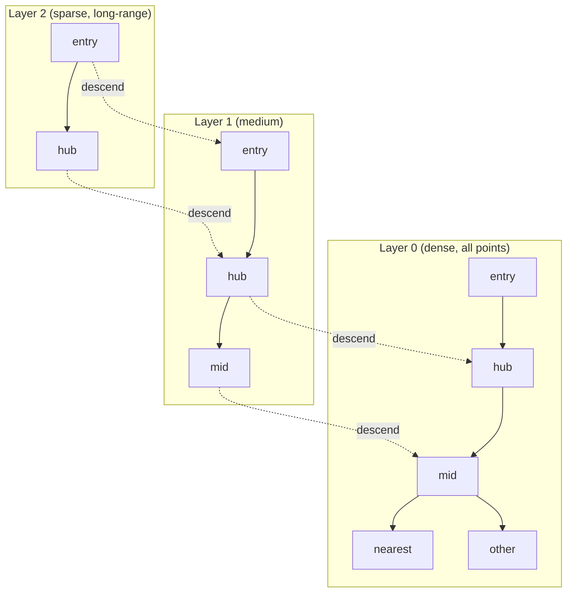

# 扩展与生态

PG 用扩展机制把社区贡献的类型、函数、操作符、索引方法以「插件」形式挂进数据库，社区围绕这一机制形成了从向量检索到地理空间、时序、模糊搜索、加密、调度的完整生态。本章过 8 个 Section：先讲扩展机制本身，再依次介绍 `pg_stat_statements`、`pgvector`、`PostGIS / TimescaleDB`、`pg_trgm`、`pg_cron`、`pgcrypto`、`hypopg`。

本模块在 `m_extensions` schema 下预置了一张 `probe` 表（5 行 `val` 字符串），仅用于 `pg_trgm` 等需要少量数据的 example。本章 example 多数是元查询（看视图、看可用扩展列表），不依赖业务数据。

> **重入约定**：所有「安装扩展」example 用 `CREATE EXTENSION IF NOT EXISTS`，且**不**在 example 里 `DROP EXTENSION`，避免破坏共享教学环境。扩展未安装时 example 报错是预期教学行为——读 SQLSTATE 与错误信息本身就是学习内容。

## 1. 扩展机制

扩展把一组数据库对象（类型、函数、操作符、索引方法、视图）打包成一个「安装单元」。`CREATE EXTENSION <name>` 将其加载到当前数据库；扩展可挂在指定 schema 下，也可分散在多个 schema 里。`pg_available_extensions` 列出当前 PG 实例已编译好、可装的扩展；`pg_extension` 列出当前数据库已装的扩展。卸载用 `DROP EXTENSION <name>`，加 `CASCADE` 会连同依赖此扩展的对象一起删除。app 角色不一定有 `CREATE EXTENSION` 权限——本章 example 通过 `pg_available_extensions` 先探测再决定是否安装。

### 语法骨架

```text
CREATE EXTENSION [IF NOT EXISTS] <name>
  [SCHEMA <schema>]
  [VERSION <version>];

DROP EXTENSION [IF EXISTS] <name> [CASCADE];
```

- `<name>`：扩展名，须在 `pg_available_extensions` 中
- `IF NOT EXISTS`：已装则跳过，使脚本可重入
- `SCHEMA <schema>`：把扩展对象建在指定 schema 下；省略时随扩展默认（通常 `public`）
- `VERSION <version>`：指定扩展版本，省略时装 `default_version`
- `CASCADE`：连同依赖该扩展的对象一起删（生产慎用）

:::example{id="list-available-extensions"}

:::example{id="list-installed-extensions"}

## 2. pg_stat_statements — 累计查询统计

`pg_stat_statements` 把每条规范化 SQL 模板（参数替换为占位）的执行次数、总耗时、平均耗时、读写块数累计到一张视图里。是定位慢查询的第一站：按 `mean_exec_time` 找单次慢的 SQL，按 `total_exec_time` 找总开销大的高频 SQL。启用条件：`postgresql.conf` 的 `shared_preload_libraries` 含 `pg_stat_statements` 且重启过实例；之后在每个数据库里 `CREATE EXTENSION pg_stat_statements` 暴露视图。本章第 19 章「监控」已点过这个扩展，这里只补可用性检查。

### 语法骨架

```text
CREATE EXTENSION IF NOT EXISTS pg_stat_statements;

SELECT queryid, query, calls, total_exec_time, mean_exec_time, rows
FROM   pg_stat_statements
ORDER  BY total_exec_time DESC
LIMIT  20;
```

- `queryid`：规范化 SQL 的哈希
- `query`：规范化后的 SQL 文本（参数为 `$1` `$2` ...）
- `calls`：执行次数
- `total_exec_time` / `mean_exec_time`：累计 / 平均执行耗时（毫秒）
- `rows`：累计返回行数

:::example{id="pg-stat-statements-availability"}

## 3. pgvector — 向量索引

`pgvector` 给 PG 加 `vector(<dim>)` 类型与三个距离操作符：`<->` L2、`<=>` cosine、`<#>` 负内积；配合 HNSW 或 IVFFlat 近似最近邻索引，把 RAG / 推荐 / 语义搜索的向量召回直接挪进 PG，省掉单独维护一个向量数据库。HNSW 是分层小世界图，构建慢、查询快、召回高，是默认选择；IVFFlat 是倒排聚类，构建快、内存小、需训练。本节先验证扩展可用性，再用一张临时表跑一遍最近邻查询。

### 语法骨架

```text
CREATE EXTENSION IF NOT EXISTS vector;

<col>  vector(<N>)                              -- 列类型，N = 向量维度

<v1> <-> <v2>     → float    L2 距离（欧氏距离）
<v1> <=> <v2>     → float    cosine 距离（1 - cosine 相似度）
<v1> <#> <v2>     → float    负内积（值越小越相似）
```

- `<N>`：向量维度，建表后不可改
- `<v1> <v2>`：均为 `vector` 列或 `'[a,b,c]'::vector` 字面量
- 索引：`CREATE INDEX ON <t> USING hnsw (<col> vector_l2_ops)` 或 `vector_ip_ops` / `vector_cosine_ops`



上图：HNSW 顶层稀疏只放 hub 节点便于跨大距离跳跃，越往下层节点越密，查询从顶层入口贪婪下降，最终在最底层精排出 K 个最近邻。

:::example{id="pgvector-availability"}

:::example{id="pgvector-demo"}

## 4. PostGIS / TimescaleDB — 地理空间与时序

`PostGIS` 给 PG 加 `geometry` / `geography` 类型与 `&&`（外包矩形相交）、`~`（包含）、`ST_DWithin` 等空间操作符 / 函数，GiST 索引加速空间查询，是事实标准的地理空间扩展。`TimescaleDB` 把普通表转成 hypertable，按时间自动分区并支持列存压缩与连续聚合，适合 IoT、监控、金融行情等时序场景。两者通常都需要在 PG 镜像之外单独安装（`postgis/postgis`、`timescale/timescaledb`）；标准 PG 镜像里不一定有，所以本节只做可用性探测。

### 语法骨架

```text
-- PostGIS
CREATE EXTENSION IF NOT EXISTS postgis;
<col>  geometry(Point, 4326)
SELECT ST_Distance(<g1>, <g2>);
SELECT * FROM places
WHERE  geom && ST_MakeEnvelope(<xmin>, <ymin>, <xmax>, <ymax>, 4326);

-- TimescaleDB
CREATE EXTENSION IF NOT EXISTS timescaledb;
SELECT create_hypertable('metrics', 'ts');
SELECT add_compression_policy('metrics', INTERVAL '7 days');
```

- PostGIS `geometry(<Type>, <SRID>)`：`<Type>` ∈ Point / LineString / Polygon / ...，`<SRID>` 是空间参考系（4326 = WGS84 经纬度）
- PostGIS 空间索引：`CREATE INDEX ON <t> USING gist (<geom-col>)`
- TimescaleDB `create_hypertable(<table>, <time-col>)`：把已有表转 hypertable
- TimescaleDB 压缩 / 连续聚合 / 数据保留策略均通过函数注册，背后由后台 worker 执行

:::example{id="postgis-availability"}

:::example{id="timescaledb-availability"}

## 5. pg_trgm — 模糊搜索

`pg_trgm` 把字符串切成所有连续三字组（trigram），用集合相似度衡量两个字符串的接近程度。`similarity(<a>, <b>)` 返回 0~1 的相似度；`<a> % <b>` 在相似度超过 `pg_trgm.similarity_threshold` 时为 true；`<a> <-> <b>` 是距离（`1 - similarity`）。它的杀手锏是给 `LIKE '%xxx%'` 这种「中间通配」查询加 GIN 或 GiST 索引——B-tree 在通配前缀场景完全失效，pg_trgm 索引能把毫秒级查询稳住。

### 语法骨架

```text
CREATE EXTENSION IF NOT EXISTS pg_trgm;

similarity(<a>, <b>)     → float       0~1，越大越像
<a> % <b>                → boolean    超过相似阈值
<a> <-> <b>              → float       距离 = 1 - similarity

CREATE INDEX [IF NOT EXISTS] <idx>
  ON <table> USING gin (<text-col> gin_trgm_ops);     -- 推荐
CREATE INDEX [IF NOT EXISTS] <idx>
  ON <table> USING gist (<text-col> gist_trgm_ops);   -- 支持 KNN 排序
```

- `<a> <b>`：均为 text 表达式
- `pg_trgm.similarity_threshold`（默认 0.3）：`%` 操作符的判定门槛，可 SET 调整
- GIN 索引：体积大、`%` / `LIKE '%x%'` 查询快、KNN 不走索引
- GiST 索引：体积小、支持 `<->` ORDER BY 的 KNN top-N 查询

:::example{id="pg-trgm-availability"}

:::example{id="pg-trgm-similarity"}

## 6. pg_cron — 库内调度

`pg_cron` 在数据库里跑 cron：用 `cron.schedule(<name>, <cron-expr>, <sql>)` 注册一个定时任务，cron 后台 worker 按时间表自动连库执行那条 SQL。适合「夜间清理旧分区」、「每小时刷物化视图」、「每天发统计邮件触发」等场景，省掉一个外部调度器。Supabase、Crunchy Bridge、Neon 等托管服务通常默认装好；自建 PG 需要在 `shared_preload_libraries` 加 `pg_cron` 并配置 `cron.database_name`。

### 语法骨架

```text
CREATE EXTENSION IF NOT EXISTS pg_cron;

SELECT cron.schedule(
  <job-name>  text,
  <schedule>  text,   -- 标准 5 段 cron 表达式
  <command>   text    -- 要执行的 SQL（单条语句字符串）
);

SELECT cron.unschedule(<job-name>);

SELECT * FROM cron.job;            -- 已注册任务
SELECT * FROM cron.job_run_details -- 执行历史
ORDER BY start_time DESC LIMIT 20;
```

- `<schedule>`：cron 表达式，如 `'0 3 * * *'` = 每天 03:00
- `<command>`：完整 SQL 字符串，跨多语句要包成 `DO $$ ... $$` 块
- `cron.schedule` 返回 job_id；后续 `cron.unschedule(<job-name>)` 注销

:::example{id="pg-cron-availability"}

## 7. pgcrypto — 加密与哈希

`pgcrypto` 提供哈希、对称加密、随机字节、随机 UUID 等密码学原语。常用：`digest(<data>, '<algo>')` 算 SHA-256 等哈希；`pgp_sym_encrypt(<data>, <key>)` / `pgp_sym_decrypt(<ciphertext>, <key>)` 做对称加密存储敏感字段（注意 key 管理）；`gen_random_uuid()` 直接生成 v4 UUID（PG 13+ 内置 `gen_random_uuid()` 也行，但靠 pgcrypto 是兼容老版本的稳妥写法）。

### 语法骨架

```text
CREATE EXTENSION IF NOT EXISTS pgcrypto;

digest(<data> bytea | text, '<algo>')      → bytea     算哈希；algo ∈ md5 / sha1 / sha224 / sha256 / sha384 / sha512
encode(<bytea>, 'hex')                     → text      二进制转十六进制字符串

pgp_sym_encrypt(<plaintext>, <key>)        → text      对称加密（PGP 格式）
pgp_sym_decrypt(<ciphertext>, <key>)       → text      对称解密

gen_random_uuid()                          → uuid      随机 v4 UUID
gen_random_bytes(<n>)                      → bytea     n 字节随机数
```

- 哈希结果是 `bytea`，展示给人看用 `encode(..., 'hex')` 或 `encode(..., 'base64')`
- `pgp_sym_*` 是 PGP 格式，自带随机 IV，同样输入每次密文不同——比较密文得先解密
- `gen_random_uuid()` 适合做主键默认值：`uuid DEFAULT gen_random_uuid()`

:::example{id="pgcrypto-availability"}

:::example{id="pgcrypto-digest-uuid"}

## 8. hypopg — 虚拟索引

`hypopg` 让 EXPLAIN 「假装」某个索引已经存在，用来在不真建索引、不锁表、不占磁盘的前提下评估「加了它 planner 会不会选、走完成本会不会降」。流程：`hypopg_create_index('CREATE INDEX ON ...')` 注册一个虚拟索引 → 在同一会话里跑 `EXPLAIN <query>` → planner 会把虚拟索引一起算进去 → 看代价、看是否被选上 → `hypopg_reset()` 清理。注意只能用 `EXPLAIN`，不能 `EXPLAIN ANALYZE`（虚拟索引没有真实物理数据可扫）。

### 语法骨架

```text
CREATE EXTENSION IF NOT EXISTS hypopg;

SELECT hypopg_create_index('CREATE INDEX ON <table> (<col>)');   -- 注册
SELECT * FROM hypopg_list_indexes;                               -- 列出当前会话虚拟索引

EXPLAIN <query>;                                                 -- planner 会考虑虚拟索引
SELECT hypopg_reset();                                           -- 清空所有虚拟索引
```

- 虚拟索引存活范围 = 当前数据库会话；连接断开自动消失
- 不支持 `EXPLAIN ANALYZE`（无真实数据）
- 适合在生产副本上验证大表索引方案

:::example{id="hypopg-availability"}
