# 监控与诊断

PG 把运行时计数和实时活动暴露成普通视图（`pg_stat_*`、`pg_locks`、`pg_settings`），可以直接 `SELECT`。本章过一遍生产里最常用的几张：库 / 表 / 索引级累计统计、当前 backend 活动、锁、`pg_stat_statements` 扩展、慢查询日志开关。

本模块在 `m_monitoring` schema 下预置了一张 `probe` 表（100 行），目的只是让本 schema 在 `pg_stat_user_tables` / `pg_stat_user_indexes` 里有可观测的非零计数。`pg_stat_statements` 是 extension，默认未必装上——本章相关 example 在未装时会报 `relation "pg_stat_statements" does not exist`（错误码 42P01），这本身是教学点。

## 1. pg_stat_database / pg_stat_user_tables — 库与表级累计统计

`pg_stat_database` 每个数据库一行，记录提交数 `xact_commit`、回滚数 `xact_rollback`、buffer 命中 `blks_hit` 和读盘 `blks_read`、`tup_returned` / `tup_fetched` 等累计计数。`pg_stat_user_tables` 每张用户表一行，记录顺序扫 `seq_scan`、索引扫 `idx_scan`、live / dead tuple、最近 VACUUM / ANALYZE 时间。两者都是单调累加的计数器，关心增量要自己采两次相减。

### 语法骨架

```text
-- 库级
SELECT datname,
       xact_commit, xact_rollback,
       blks_hit, blks_read,
       tup_returned, tup_fetched
FROM pg_stat_database
WHERE datname = current_database();

-- 表级
SELECT relname,
       seq_scan, idx_scan,
       n_live_tup, n_dead_tup,
       last_vacuum, last_analyze
FROM pg_stat_user_tables
WHERE schemaname = '<schema>';
```

- `xact_commit` / `xact_rollback`：本库累计提交 / 回滚事务数
- `blks_hit` / `blks_read`：buffer cache 命中 / 从磁盘读的块数，比值即命中率
- `seq_scan` / `idx_scan`：本表被顺序扫 / 索引扫的次数
- `n_live_tup` / `n_dead_tup`：估算的存活 / 死元组数（VACUUM 的输入信号，见 ch18）

:::example{id="db-level-stats"}

:::example{id="table-scan-stats"}

:::example{id="cache-hit-ratio"}

## 2. pg_stat_user_indexes — 索引被用了几次

`pg_stat_user_indexes` 每个用户索引一行，关键列 `idx_scan` 是该索引被用作扫描入口的累计次数。`idx_tup_read` 是从索引里读出的条目数，`idx_tup_fetch` 是因此从堆里取回的行数。`pg_statio_user_indexes` 是同表的 IO 视角（命中 / 读盘块）。`idx_scan = 0` 的索引是删除候选——上线一段时间从没被规划器选中过，说明白占空间还拖慢写入。

### 语法骨架

```text
SELECT indexrelname,
       idx_scan, idx_tup_read, idx_tup_fetch
FROM pg_stat_user_indexes
WHERE schemaname = '<schema>';

SELECT indexrelname,
       idx_blks_read, idx_blks_hit
FROM pg_statio_user_indexes
WHERE schemaname = '<schema>';
```

- `idx_scan`：索引被规划器选用的次数；0 = 死索引候选
- `idx_tup_read`：索引扫描期间访问的索引条目数
- `idx_tup_fetch`：由索引扫触发的堆元组取回次数
- `idx_blks_read` / `idx_blks_hit`：索引页的磁盘 / cache 访问次数

:::example{id="index-usage"}

:::example{id="unused-index-candidates"}

## 3. pg_stat_activity — 谁在跑什么

`pg_stat_activity` 每个 backend 一行，记录其连接信息、当前状态 `state`、当前 / 上一条 query 文本、事务开始时间 `xact_start`、最近一次 wait 的 `wait_event` 等。`state = 'active'` 是正在跑 SQL，`'idle in transaction'` 是开了事务但卡在客户端等下一条语句——典型的「忘了 COMMIT」事故，长时间持有的是行锁和 snapshot，会顶住 VACUUM。`pg_cancel_backend(pid)` 发取消信号（中断当前语句），`pg_terminate_backend(pid)` 直接杀掉连接。

### 语法骨架

```text
SELECT pid, usename, state, xact_start, query, wait_event
FROM pg_stat_activity
WHERE datname = current_database();

SELECT pg_cancel_backend(<pid>);     -- 温柔：取消当前语句，保留连接
SELECT pg_terminate_backend(<pid>);  -- 强制：断开连接
```

- `pid`：backend 进程号，用于后续 cancel / terminate
- `state`：`active` / `idle` / `idle in transaction` / `idle in transaction (aborted)`
- `xact_start`：事务开始时刻；`now() - xact_start` 即事务已经开了多久
- `wait_event`：当前等待的事件名（锁、IO、IPC 等），NULL 表示没在等

:::example{id="current-activity"}

:::example{id="idle-in-transaction-detect"}

## 4. pg_locks — 锁与阻塞链

`pg_locks` 列出当前所有被持有 / 在等待的锁，每行一把锁。和 `pg_stat_activity` 按 `pid` join 起来，可以看到「哪条 SQL 持有什么锁」。`granted = false` 是正在等的锁。`pg_blocking_pids(pid)` 直接返回阻塞当前 backend 的 pid 数组，比手 join `pg_locks` 简单得多；多数时刻没人在等，返回空数组。

### 语法骨架

```text
SELECT l.locktype, l.mode, l.granted,
       l.pid, a.state, a.query
FROM pg_locks l
JOIN pg_stat_activity a USING (pid)
WHERE a.datname = current_database();

SELECT pid, pg_blocking_pids(pid) AS blocked_by
FROM pg_stat_activity
WHERE datname = current_database();
```

- `locktype`：锁对象类型（`relation`、`transactionid`、`tuple`、`advisory` 等）
- `mode`：锁模式（`AccessShareLock`、`RowExclusiveLock`、`ShareLock`、`ExclusiveLock` 等）
- `granted`：true 已拿到 / false 在等
- `pg_blocking_pids(pid)`：阻塞指定 pid 的所有 pid 集合

```mermaid
flowchart LR
  A["backend pid=A&#10;UPDATE row 1&#10;granted: RowExclusive"] -. waits .-> B["backend pid=B&#10;UPDATE row 1&#10;granted: RowExclusive"]
  B --> R["row 1"]
  A -. blocked by .-> B
```



> 上图是单向阻塞：B 先拿到 row 1 的行锁，A 来 UPDATE 同一行，进入等待。互相循环就成了死锁（见 ch11），PG 会自动检测并杀掉其中一方。

:::example{id="current-locks"}

:::example{id="blocking-chain-shape"}

## 5. pg_stat_statements — 累计语句级统计（扩展）

`pg_stat_statements` 是官方 contrib 扩展，把每条 SQL 按参数化模板聚合，记录累计执行次数 `calls`、总耗时 `total_exec_time`、平均耗时 `mean_exec_time`、累计 IO 等。是「找慢 SQL」的事实标准入口，定位「为什么累计耗时多」比看一次执行的 EXPLAIN 更直接。它是 extension，托管服务多数预装，自建实例需要 `shared_preload_libraries = 'pg_stat_statements'` + `CREATE EXTENSION` 才有。

### 语法骨架

```text
-- 一次性安装（需要超级用户 + 重启后 shared_preload_libraries 生效）
CREATE EXTENSION IF NOT EXISTS pg_stat_statements;

-- 找累计平均耗时最高的 N 条
SELECT query, calls, mean_exec_time, total_exec_time
FROM pg_stat_statements
ORDER BY mean_exec_time DESC
LIMIT 10;
```

- `query`：被参数化后的 SQL 模板（字面量被替换成占位符）
- `calls`：该模板被执行的累计次数
- `mean_exec_time`：单次平均执行耗时（毫秒）
- `total_exec_time`：累计耗时；按这一列排序找「最值得优化」的语句

:::example{id="pg-stat-statements-check"}

:::example{id="top-slow-statements"}

## 6. 慢查询日志 — log_min_duration_statement

PG 可以把执行时间超过阈值的 SQL 写到服务器日志里，配置项 `log_min_duration_statement`（毫秒，`-1` 关闭、`0` 记录全部）。`log_statement = 'all' / 'ddl' / 'mod' / 'none'` 是另一维度的开关，按语句类型而非耗时。日志本身落在文件 / 日志服务里，不能直接 SQL 查；本节只演示通过 `pg_settings` 看当前阈值。

### 语法骨架

```text
SELECT name, setting, unit
FROM pg_settings
WHERE name IN ('log_min_duration_statement', 'log_statement');

-- 改阈值（需要权限 / 重载配置；这里只是参考）
-- ALTER SYSTEM SET log_min_duration_statement = '500ms';
-- SELECT pg_reload_conf();
```

- `log_min_duration_statement`：超过 N 毫秒的语句进日志；`-1` 关、`0` 全量
- `log_statement`：按语句类型记录，与上一项独立，两者满足任一即记录
- `pg_settings`：所有 GUC 参数的视图；`name` 唯一

:::example{id="show-slow-log-threshold"}
