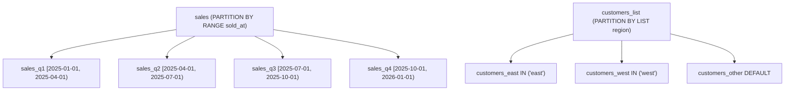
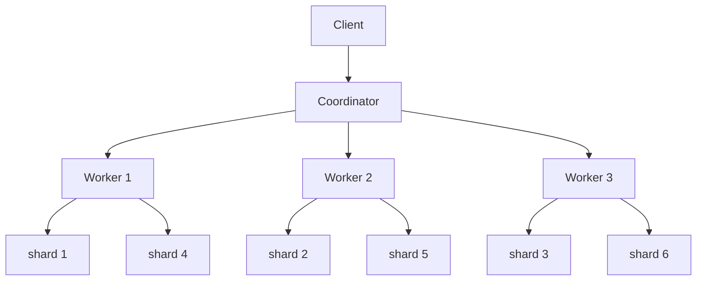

# 分区与分片

把一张大表水平切成多张物理子表，是 PG 处理时间归档、租户隔离、超大表维护的常规手段。**分区**（partitioning）由 PG 原生支持，在单实例内按规则把行落到不同子表里；**分片**（sharding）则跨越多台机器，本身不在 PG 核心里，靠 Citus 等扩展实现。本章覆盖声明式分区的策略、裁剪、维护、特殊点，最后用一小节区分分片与分区。

本模块在 `m_partition_sharding` schema 下预置了两张分区表：`sales`（RANGE 按 `sold_at` 切 4 个 quarter，共 8000 行）和 `customers_list`（LIST 按 `region` 切 east/west/DEFAULT，共 60 行）。

## 1. 分区策略概览

**声明式分区**（PG 10+）让你把一张「主表」按某个键切成多张子表：主表自身不存数据，只是路由器；INSERT 自动落到对应子表，SELECT 通过主表透明访问全部数据。三种切分策略：**RANGE**（区间，常用按时间）、**LIST**（枚举值，常用按租户/region）、**HASH**（哈希余数，把数据均匀打散）。

### 语法骨架

```text
CREATE TABLE <parent> (
  <columns ...>
) PARTITION BY {RANGE | LIST | HASH} (<key>);

CREATE TABLE <child> PARTITION OF <parent>
  FOR VALUES FROM (<lo>) TO (<hi>);          -- RANGE

CREATE TABLE <child> PARTITION OF <parent>
  FOR VALUES IN (<v1>, <v2>, ...);           -- LIST

CREATE TABLE <child> PARTITION OF <parent>
  FOR VALUES WITH (MODULUS <m>, REMAINDER <r>);  -- HASH
```

- `<key>`：分区键，可以是列或表达式；查询带这个键才能裁剪
- `RANGE`：左闭右开区间，相邻子表 `TO` 必须等于下一个的 `FROM`
- `LIST`：每个子表声明属于自己的离散值集合；可加 `DEFAULT` 兜底
- `HASH`：所有子表 `MODULUS` 相同，`REMAINDER` 取遍 `0..M-1`



:::example{id="list-partitions-of-sales"}

:::example{id="list-partitions-of-customers"}

## 2. 分区裁剪（pruning）

带分区键的 `WHERE` 条件让 planner 在编译期就跳过不可能命中的子表——这叫**分区裁剪**。EXPLAIN 输出里能看到 `Partitions pruned: N` 提示，或者干脆只显示被扫到的那个子表。不带分区键的查询无法裁剪，planner 会扫全部子表（Append 节点下挂一堆 Seq Scan）。`enable_partition_pruning` 默认 on，关闭后裁剪失效。

### 语法骨架

```text
SELECT ...
FROM   <partitioned-table>
WHERE  <partition-key> {= | < | <= | > | >= | BETWEEN ...} <value>;
```

- `<partition-key>`：必须是分区键本身，函数包装会失败（如 `WHERE date_trunc('month', sold_at) = ...` 无法裁剪）
- 谓词支持等值、范围、`IN` 列表、`BETWEEN`
- EXPLAIN 不需要 ANALYZE 就能看到裁剪结果

:::example{id="partition-prune-explain"}

:::example{id="partition-no-prune-no-key"}

## 3. 分区维护（ATTACH / DETACH / DROP）

新季度到来时建一张独立子表再 **ATTACH** 进主表；归档老数据时把子表 **DETACH** 出来变成普通独立表，再 `DROP` 或备份走。ATTACH 时 PG 会校验子表中所有行都满足分区边界（瓶颈在大表上明显）；DETACH 默认走快路径（瞬时），加 `CONCURRENTLY` 则无需阻塞读写。

### 语法骨架

```text
CREATE TABLE <child> (LIKE <parent> INCLUDING ALL);
ALTER TABLE <parent> ATTACH PARTITION <child>
  FOR VALUES FROM (<lo>) TO (<hi>);

ALTER TABLE <parent> DETACH PARTITION <child> [CONCURRENTLY];

DROP TABLE <child>;
```

- `LIKE <parent> INCLUDING ALL`：拷主表列、约束、索引、默认值
- ATTACH 时 `FOR VALUES` 必须和其他子表不重叠
- DETACH 后子表变成普通表，可以独立查询、备份、迁移
- 直接 `DROP TABLE <child>` 也合法，等价于 DETACH + DROP

:::example{id="attach-partition"}

:::example{id="detach-partition"}

## 4. 插入 / 索引 / 约束的特殊点

分区表的写入和约束有几条不同于普通表的规则。INSERT 自动按分区键路由到正确子表，越界值会报错（除非有 `DEFAULT` 分区）。索引方面，PG 11+ 在主表上 `CREATE INDEX` 会自动在每个子表建对应索引，称为**全局分区索引**（实际是主表上的抽象 + 子表上的本地索引）。UNIQUE / PRIMARY KEY 约束必须**包含分区键**，否则 PG 拒绝创建——因为跨子表无法廉价地强制唯一性。外键引用分区表也有限制（PG 12+ 支持，但被引用列需含分区键）。

### 语法骨架

```text
INSERT INTO <parent> (...) VALUES (...);
-- 自动路由；可用 RETURNING tableoid::regclass 看落到哪个子表

CREATE INDEX ON <parent> (<col>);
-- 自动在所有现有 + 未来子表上建对应本地索引

CREATE UNIQUE INDEX ON <parent> (<col>, <partition-key>);
-- UNIQUE 必须包含分区键
```

- `tableoid::regclass`：每行隐含的伪列，转 regclass 得到所在子表名
- 主表上建的索引名是主表层抽象，看 `pg_indexes` 时每个子表都会有独立条目
- `PRIMARY KEY (id)` 在分区表上会报错，需写成 `PRIMARY KEY (id, sold_at)`

:::example{id="auto-route-insert"}

:::example{id="index-on-parent-propagates"}

## 5. 分片 — Citus 点到为止

**分区**和**分片**都是水平切表，但工作层次不同：分区在**单实例**内把表切成多张子表，所有数据还在同一台机器；分片把数据切到**多台机器**上，靠分布式协调器路由查询。PG 核心不带分片，要装 **Citus** 扩展（开源，Microsoft 维护）：coordinator 节点拿到 SQL 后按**分布键**（distribution column）的哈希值把子查询发到对应 worker 节点，最后汇总结果。本课程不部署多节点环境，仅做概念引介。

### 语法骨架

```text
CREATE EXTENSION citus;                                -- 装扩展

SELECT create_distributed_table('<table>', '<col>');   -- 把表分布到 worker
SELECT create_reference_table('<table>');              -- 小表复制到所有 worker

SELECT * FROM citus_shards;                            -- 看 shard 在哪个 worker
```

- `<col>`：分布键，应选高基数、查询常带的列（如 `tenant_id`、`user_id`）
- 分布键决定哪些数据落在同一台 worker，影响 join 是否能本地化
- reference table 适合维度小表（国家、币种）



:::example{id="citus-check"}
