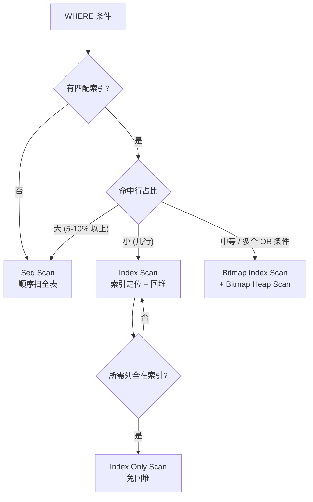

# 查询优化与执行计划

PG 是声明式查询：你写 SQL 描述要什么，**planner**（查询优化器）决定怎么取。它会基于 `pg_statistic` 里的统计估算每种执行方案的代价，挑最便宜的那个生成**执行计划**。`EXPLAIN` 把这个计划打出来；`EXPLAIN ANALYZE` 真跑一遍并附实测行数和时间。读懂计划是定位线上慢查询的基本功。

本模块在 `m_performance` schema 下预置两张表：`customers`（1000 行）和 `orders`（10 万行，`customer_id` 关联 `customers.id`，`status` 取 `pending` / `paid` / `shipped`）。所有 EXPLAIN example 都把 statement_timeout 拉到 30s。

## 1. EXPLAIN 基础 — 看计划与跑计划

`EXPLAIN <sql>` 只让 planner 生成计划、不真跑，输出每个节点的估算行数和代价。`EXPLAIN ANALYZE <sql>` 真把语句跑一遍并附实测时间和实际行数——但**会执行副作用**（INSERT/UPDATE/DELETE 真写盘，要用事务回滚保护）。常用选项：`BUFFERS` 报告每个节点的 buffer 命中和读盘；`FORMAT JSON` 输出机器可读的结构。计划是棵树，缩进表示父子，从最深的叶子（数据源）往上读。

### 语法骨架

```text
EXPLAIN [( <option> [, <option> ...] )] <statement>;

<option> :=
    ANALYZE          -- 真跑语句，附实测
  | BUFFERS          -- 附 shared/local hit, read 等
  | VERBOSE          -- 附输出列、schema 限定
  | FORMAT TEXT | JSON | XML | YAML
```

- `ANALYZE`：真执行；对 DML 用 `BEGIN; EXPLAIN ANALYZE ...; ROLLBACK;` 保护
- `BUFFERS`：诊断缓存命中率，必须配合 `ANALYZE`
- `FORMAT JSON`：方便把计划喂给可视化工具或脚本解析
- 节点缩进 = 父子关系，从底向上读：叶子是 Seq Scan / Index Scan 等数据源

:::example{id="explain-plain"}

:::example{id="explain-analyze-buffers"}

:::example{id="explain-format-json"}

## 2. 扫描节点 — Seq / Index / Bitmap

扫描节点是计划树的叶子，负责从表里取行。**Seq Scan** 顺序读整张表，命中行数占比大时反而最快。**Index Scan** 走索引定位行再回堆取数据，命中少量行时最快。**Index Only Scan** 是 Index Scan 的特例：要的列全在索引里、可见性 map 也允许，就不用回堆。**Bitmap Index Scan + Bitmap Heap Scan** 组合用于命中中等量行、或多个索引取交并集的场景：先用索引建一张 bitmap，再按物理顺序回堆，避免乱序 I/O。

### 语法骨架

```text
节点名                       触发条件                              典型场景
─────────────────────────    ──────────────────────────────────    ──────────────────
Seq Scan                     无可用索引 / 命中行占比大              全表扫
Index Scan                   有匹配索引 + 命中行少                  等值或小范围
Index Only Scan              Index Scan + 所需列全在索引            覆盖索引
Bitmap Index Scan + Heap     单索引命中中等量行 / 多索引 OR / AND   范围查询、OR 组合
```

- `Seq Scan`：planner 估算大批量命中时优先选；磁盘顺序 I/O 友好
- `Index Scan`：随机 I/O，命中少时才划算
- `Index Only Scan`：要求 `VACUUM` 更新过可见性 map，否则会退化
- `Bitmap...`：可叠加 `BitmapAnd` / `BitmapOr` 合并多个索引结果



:::example{id="force-seq-scan"}

:::example{id="index-scan"}

:::example{id="bitmap-scan-or"}

## 3. JOIN 算法 — Nested Loop / Hash / Merge

PG 有三种 JOIN 物理算子，planner 按表大小、是否有索引、是否有序选。**Nested Loop** 对外层每行去内层查一次，外层小、内层有索引时最快——其它场景是性能灾难。**Hash Join** 适合大表 + 等值条件：先把小表读完建哈希表，再扫大表 probe；只能等值。**Merge Join** 要求两边都按 JOIN 键有序，归并扫一遍即可；通常配合 Index Scan 或前置 Sort 出现。

### 语法骨架

```text
算法              复杂度        要求             典型场景
──────────────    ──────────    ─────────────    ─────────────────────────
Nested Loop       O(N * M)      无               一边很小 / 内层有索引
Nested Loop       O(N * log M)  内层有索引       小批量 LIMIT + JOIN
Hash Join         O(N + M)      等值条件         大表 + 大表等值 JOIN
Merge Join        O(N + M)      两边按 key 有序  已排序数据 / 索引扫
```

- `Nested Loop`：外层行数大时灾难性，看到大表 + Nested Loop 立即怀疑统计或索引
- `Hash Join`：构建小表 hash table，内存放不下会 spill 到磁盘（Batches > 1）
- `Merge Join`：常因 ORDER BY 同 JOIN 键被自然选中；不等值条件无效

:::example{id="nested-loop-small"}

:::example{id="hash-join-large"}

## 4. 聚合、排序、Limit

聚合分两种：**HashAggregate** 用 hash 表按分组键归类，无需排序；**GroupAggregate** 输入已按分组键有序，扫一遍直接出结果。**Sort** 节点显式排序，下挂 `Memory` 或 `Disk` 标识用了内存还是临时文件（受 `work_mem` 限制）。**Limit** 截断上游流。Sort + Limit 时，如果有匹配 ORDER BY 的索引，planner 会用 Index Scan 顺着读、跳过 Sort——这就是为什么"分页前几条"想快必须建排序索引。

### 语法骨架

```text
节点名               触发条件                                 备注
─────────────────    ─────────────────────────────────────    ──────────────────
HashAggregate        GROUP BY，输入未排序                     内存里 hash 分组
GroupAggregate       GROUP BY，输入已按分组键有序             Sort 或 Index Scan 在下
Sort                 ORDER BY 或 Merge Join 需要有序输入      Memory: ... / Disk: ...
Limit                LIMIT n                                  上游可能用 Index 顺读跳 Sort
```

- `HashAggregate`：`Batches: 1` 说明全在内存；大于 1 表示 spill 到磁盘
- `Sort`：`Sort Method: quicksort Memory: XkB` 是内存排；`external merge Disk: XkB` 是落盘
- `Limit + Index Scan`：分页热点查询的最优形态，比 Sort + Limit 快几个数量级

:::example{id="agg-hash"}

:::example{id="sort-then-limit"}

:::example{id="index-skips-sort"}

## 5. ANALYZE 与统计信息

planner 的所有代价估算都建立在 `pg_statistic` 里的统计上——每列的 `n_distinct`（不同值个数）、`null_frac`（NULL 占比）、`histogram_bounds`（直方图分桶）、`most_common_vals`（高频值）等。`ANALYZE <table>` 重采样这些统计；`autovacuum` 默认会按表变动比例自动跑（详见 ch18）。**大批量 INSERT / UPDATE / DELETE 之后**，统计若没更新，planner 会按旧分布选错算法——例如把已增到百万行的表当成几行，结果上来就 Nested Loop。诊断时先看 `EXPLAIN ANALYZE` 里 `(Estimated rows=X, Actual rows=Y)` 差距是否数量级偏差。

### 语法骨架

```text
ANALYZE [VERBOSE] [<table> [(<column> [, ...])]];

SELECT attname, n_distinct, null_frac, most_common_vals
FROM pg_stats
WHERE schemaname = '<schema>' AND tablename = '<table>';
```

- `ANALYZE` 不带参数：扫全库所有表
- `ANALYZE <table>`：只重采样一张表
- `ANALYZE <table>(<col>)`：只更新指定列的统计
- `VERBOSE`：打印采样进度
- `pg_stats` 是 `pg_statistic` 的人类可读视图

:::example{id="analyze-table"}

:::example{id="pg-stats-inspect"}

## 6. 查询改写与索引诊断

planner 再聪明也救不了写法把索引"锁"在门外。常见反模式：函数包裹索引列（`WHERE lower(name) = 'alice'`）让 B-tree 索引完全无用，要么改写谓词、要么建表达式索引；隐式类型转换（`WHERE int_col = '42'`）有时能用、有时被转换函数挡住，索引行为不稳；`SELECT *` 会让原本可走 Index Only Scan 的查询退化成回堆；OR 跨列条件偶尔比拆 `UNION ALL` 慢得多；缺少多列索引导致 Bitmap 合并而不是单 Index Scan。诊断套路：跑 `EXPLAIN ANALYZE`，看 `Actual rows` vs `Estimated rows` 差距，再看是不是该走索引的 Seq Scan。

### 语法骨架

```text
反模式                              症状                       修复方向
──────────────────────────────      ────────────────────       ─────────────────────────
WHERE lower(col) = '...'            Seq Scan，索引完全跳过      建 expression index 或改谓词
WHERE int_col = '42' (字符串)        cast 进谓词，索引可能失效   保持类型一致
SELECT * FROM ... WHERE indexed=?    退化为 Index Scan + 回堆    只 SELECT 索引覆盖的列
WHERE a=? OR b=? (无单索引)          BitmapOr 慢                改 UNION ALL 或建组合索引
ORDER BY col LIMIT 10 (无索引)       Sort + Limit               建 (col DESC) 索引跳 Sort
```

- 表达式索引：`CREATE INDEX ON t (lower(name))`，必须用同一表达式查询才命中
- 类型一致：`bigint` 列就用 `bigint` 字面量，不要用字符串
- Index Only Scan 需要列被索引覆盖 + 可见性 map 是新的

:::example{id="function-on-column-blocks-index"}

:::example{id="implicit-cast-blocks-index"}
