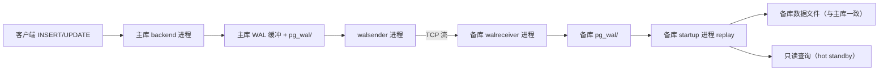
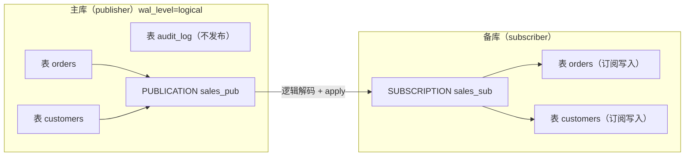
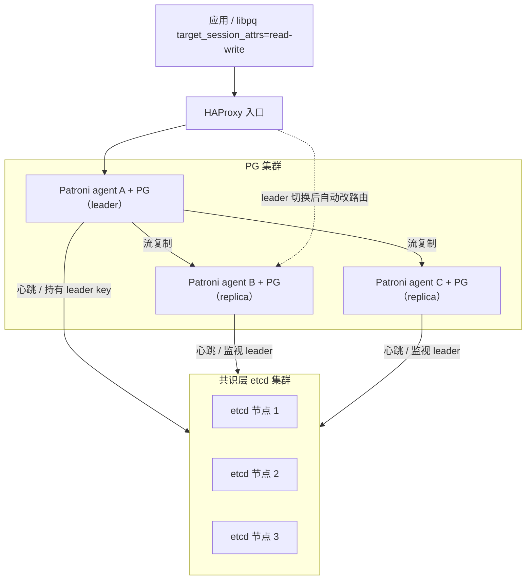

# 复制与高可用

复制（replication）让一份数据在多台 PG 实例之间持续同步：一台**主库**接受写入，一台或多台**备库**跟随主库的变更。从此可以做读写分离、故障切换、跨地域容灾。PG 内置两种复制：**物理复制**复制 WAL 字节，整库镜像；**逻辑复制**复制行变更，可挑表。本章过一遍这两条路径、同步级别、CDC、以及高可用方案。

教学环境是单实例，**没有备库**，所以本章绝大多数 example 会返回 0 行或某个表示「这里是主库 / 没有任何复制活动」的值——**这是预期结果，不是错误**。这些视图存在于任何 PG 库里，正是用来观察复制状态的入口。

## 1. 物理复制（流复制）

物理复制把主库产生的 WAL 字节流持续发送给备库，备库一边接收一边 replay，从而保持与主库二进制级一致。它复制的是「整个集簇」，不能挑库挑表；备库一旦打开 hot standby 可以接受只读查询。两端必须**主版本号一致**，跨大版本升级不能用流复制做。

### 语法骨架

```text
[主库 backend] --(WAL 缓冲)--> [walsender 进程] --TCP--> [备库 walreceiver 进程] --> [备库 startup/recovery 进程 replay]
```

- `walsender`：主库给每个连上来的备库 fork 一个发送进程
- `walreceiver`：备库唯一进程，负责接收 WAL 并落盘
- `startup`：备库回放 WAL 的进程；hot standby 模式下允许只读查询
- 备库 `recovery.signal` / `standby.signal` 文件存在才进入 standby 模式
- 复制槽（replication slot）可选，让主库保留备库尚未消费的 WAL，避免被清理



:::example{id="show-replication-role"}

:::example{id="pg-stat-replication"}

:::example{id="replication-slots"}

## 2. 同步级别

`synchronous_commit` 控制主库的 `COMMIT` 在什么时机返回成功，决定持久性与延迟的取舍。它和 `synchronous_standby_names` 配合，后者列出哪些备库算「同步备库」。没有同步备库时即使设了 `on` 也只等本地落盘。

### 语法骨架

```text
synchronous_commit = off | local | on | remote_apply

# off          —— 主库 WAL 还在内存就返回，崩溃可能丢最近几条
# local        —— 等主库 WAL 落盘再返回，不等备库
# on (默认)    —— 等主库落盘 + 同步备库收到 WAL，备库崩溃前已耐久
# remote_apply —— 等同步备库 replay 完，读备库立刻能见到该事务
```

- `synchronous_standby_names`：列出充当同步备库的 `application_name`，空串表示无同步备库（默认）
- 同步级别越高，写入延迟越大；同步备库一旦不可达，写会被卡住

:::example{id="show-sync-params"}

## 3. 逻辑复制

逻辑复制基于「行变更」事件：主库把 INSERT/UPDATE/DELETE 解码成逻辑流，订阅端把这些变更应用到自己的表里。它复制的是**行**而不是字节，所以可以跨大版本、可以只选部分表、两端表结构允许有差异（兼容前提下）。`wal_level` 必须设到 `logical`；只复制 DML，不复制 DDL，建表 / 加列要两端各自做。

### 语法骨架

```text
-- 主库（publisher）：声明要对外发布哪些表
CREATE PUBLICATION <pub-name>
  FOR TABLE <t1>, <t2>, ...
  [WITH (publish = 'insert,update,delete,truncate')];

-- 备库（subscriber）：从某主库订阅一个 publication
CREATE SUBSCRIPTION <sub-name>
  CONNECTION '<libpq-conninfo>'
  PUBLICATION <pub-name>;
```

- `<pub-name>` / `<sub-name>`：两端各自的对象名，库内唯一
- `FOR TABLE`：列出要发布的表；也可 `FOR ALL TABLES` 全发
- `<libpq-conninfo>`：标准 PG 连接串 `host=... port=... dbname=... user=...`
- 订阅端创建后会自动连上发布端，初始拷贝一遍存量数据再进入增量阶段



:::example{id="wal-level-check"}

:::example{id="pg-publication-list"}

:::example{id="pg-subscription-list"}

## 4. CDC — Change Data Capture

CDC 是「把数据库的写入变更抓出来给下游消费」的统称。PG 通过**逻辑解码**实现：建一个逻辑复制槽，挂一个**输出插件**（output plugin），插件把 WAL 解码成下游需要的格式（pgoutput 二进制 / wal2json 文本 JSON / decoderbufs Protobuf），消费者持续从槽里拉。Debezium、Materialize、各种「同步到 Kafka / 索引 / 数据湖」的工具都基于这套机制。

### 语法骨架

```text
[表的 INSERT/UPDATE/DELETE]
       │
       ▼
[WAL 记录写入 pg_wal/]
       │
       ▼
[逻辑解码（按 slot 推进）]
       │
       ▼
[输出插件：pgoutput / wal2json / decoderbufs ...]
       │
       ▼
[消费者：Debezium → Kafka / 自建消费者 / Materialize ...]
```

- 槽 + 插件由 `pg_create_logical_replication_slot('slot_name', 'plugin_name')` 创建
- pgoutput 是 PG 内置插件，逻辑复制（第 3 节）默认就用它
- wal2json / decoderbufs 是第三方插件，要装扩展

:::example{id="inspect-decoding-plugins"}

## 5. 高可用方案

单机 PG 再可靠也敌不过机器死亡。**高可用（HA）** 的目标是：主库挂掉时自动选一个备库顶上，客户端尽量无感。一套 HA 需要三个角色：**监控**（谁活着）、**选主 / 共识**（让大家就「现在谁是主」达成一致）、**路由**（客户端总能找到当前的主）。社区主流是 **Patroni** + etcd / Consul / ZooKeeper 做共识，**HAProxy** 或 **pgbouncer** 做入口路由；云厂商（RDS / Aurora / CloudSQL）把这一套封进托管服务。客户端侧 libpq 支持 `target_session_attrs=read-write`，在多个 host 里自动挑可写的那个。

### 语法骨架

```text
HA 组件清单：
  - 监控        —— Patroni / repmgr / pg_auto_failover
  - 共识 / 选主 —— etcd / Consul / ZooKeeper
  - 路由        —— HAProxy / pgbouncer / 客户端 multi-host + target_session_attrs
  - 备份        —— pgBackRest / WAL-G（→ ch24）
```

- Patroni：Python 编写的 HA agent，封装监控 + 选主 + 配置 PG
- `target_session_attrs=read-write`：libpq 在多个 host 里挑当前主的查询条件
- 云上的 RDS Multi-AZ / Aurora 不暴露内部组件，但角色是同一套



:::example{id="target-session-attrs-note"}
