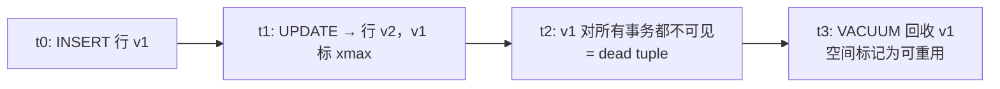
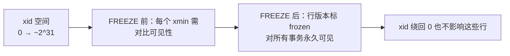

# VACUUM 与表膨胀

PG 的 MVCC 让 UPDATE / DELETE 不就地修改、而是留下老版本行（dead tuple）。dead tuple 累积叫**表膨胀**——物理文件越来越大、缓存命中率下降、Index Only Scan 失效。VACUUM 家族的工作就是回收这些 dead tuple。本章覆盖 dead tuple 来源、`VACUUM` / `VACUUM FULL` / autovacuum / FREEZE 与 wraparound、以及索引膨胀和 REINDEX。

本模块在 `m_vacuum` schema 下预置了一张 `bloat_demo` 表（1 万行，payload 200 字节）。**注意**：`VACUUM` / `REINDEX` 不能在事务里执行，本课程的运行器是事务内执行，所以含 VACUUM 字样的示例 SQL 仅作语义展示，运行时实际查询的是 `pg_stat_user_tables` / `pg_class` 等系统视图，让你看到 vacuum 留下的可观测痕迹。

## 1. Dead Tuple — 来自哪里

UPDATE 和 DELETE 都不就地修改：UPDATE 写一个新行版本，老版本被标记为 `xmax = <当前事务 id>`；DELETE 只标 `xmax`，行物理仍在。当没有任何活跃事务还能看到老版本时，它就变成 dead tuple，等 VACUUM 来回收。累积到一定量就是表膨胀。

### 语法骨架

```text
-- UPDATE 前：1 个 live tuple
[id=1, payload='a', xmin=100, xmax=0]

-- UPDATE 后：1 个 live + 1 个 dead
[id=1, payload='a', xmin=100, xmax=200]   <- 老版本，dead 候选
[id=1, payload='b', xmin=200, xmax=0]     <- 新版本，live
```

- `xmin`：插入该行版本的事务 id
- `xmax`：删除或更新该行版本的事务 id；0 表示未被删除
- VACUUM 把所有活跃事务都看不到的老版本回收为可重用空间



:::example{id="inspect-dead-tuples-before"}

:::example{id="make-dead-tuples"}

## 2. VACUUM — 回收空间

`VACUUM <table>` 扫描表，把所有 dead tuple 占的空间标记为可重用（**不会缩小表文件**），同时更新 visibility map 让后续的 Index Only Scan 可以跳过堆访问。VACUUM 普通模式只加 `SHARE UPDATE EXCLUSIVE` 锁，不阻塞读写。后台 autovacuum 进程会按阈值自动触发普通 VACUUM。

### 语法骨架

```text
VACUUM [VERBOSE] [<table> [, ...]];
VACUUM [(option [, ...])] [<table>];
```

- `<table>`：省略则 vacuum 当前可见 schema 下所有表
- `VERBOSE`：打印每个表扫到多少 dead tuple、回收多少页
- `(option, ...)`：现代写法，常用 `(VERBOSE, ANALYZE)`
- VACUUM 必须在自己的事务外运行（不能写在 BEGIN/COMMIT 块里）

:::example{id="vacuum-basic"}

:::example{id="vacuum-verbose"}

## 3. VACUUM FULL — 真正回收磁盘

普通 VACUUM 只标空间可重用、不还给 OS。`VACUUM FULL` 把表重写成一个新文件，跳过 dead tuple，老文件删掉——磁盘真正缩小。代价是**全表 ACCESS EXCLUSIVE 锁**：期间表完全不可读写。生产慎用，长期方案是 `CLUSTER`（按某索引顺序重写，同样要锁）或 pg_repack 扩展（在线重组，不需独占锁）。

### 语法骨架

```text
VACUUM FULL [<table> [, ...]];
```

- `<table>`：被重写的表，省略则全库重写（几乎不会用）
- 持有 ACCESS EXCLUSIVE 锁，期间读写全部阻塞
- 重写期间需要约等于原表大小的额外磁盘空间
- 替代品：`CLUSTER <table> USING <index>`（同样要锁）/ `pg_repack`（扩展，可在线）

:::example{id="relation-size-before-after-full"}

## 4. Autovacuum — 后台自动跑

PG 启动一组 autovacuum worker 进程，定期扫所有表，当 dead tuple 估计数超过阈值时自动触发普通 VACUUM。两个关键参数控制触发：固定阈值 `autovacuum_vacuum_threshold` 加上按表行数比例的 `autovacuum_vacuum_scale_factor`，公式是 `threshold + scale_factor * reltuples`。写多的大表常需要把 scale_factor 调低（如 0.05 表示 dead tuple 占 5% 就触发）。

### 语法骨架

```text
-- 全局参数（postgresql.conf）
autovacuum                          = on
autovacuum_vacuum_threshold         = 50          -- 行数阈值，固定项
autovacuum_vacuum_scale_factor      = 0.2         -- 行数比例，与 reltuples 相乘
autovacuum_vacuum_cost_delay        = 2ms         -- vacuum 工作每段后的休眠

-- 表级覆盖
ALTER TABLE <table> SET (autovacuum_vacuum_scale_factor = <num>);
ALTER TABLE <table> RESET (autovacuum_vacuum_scale_factor);
```

- `autovacuum_vacuum_threshold` + `scale_factor * reltuples`：超过即触发
- `cost_delay`：调小让 vacuum 跑得更快、占用更多 IO；调大相反
- 表级 storage parameter 完全覆盖同名全局参数，只影响该表
- `last_autovacuum` 字段在 `pg_stat_user_tables` 里可查最近一次时间

:::example{id="show-autovacuum-settings"}

:::example{id="last-autovacuum-time"}

:::example{id="set-table-autovacuum-aggressive"}

## 5. FREEZE — 事务 ID wraparound

PG 的事务 id 是 32 位整数，约 21 亿后会绕回 0。如果某行的 `xmin` 比当前 xid 旧太多，可见性比较就会出错。VACUUM 会把"足够老"的行版本标记为 frozen——所有事务都视其可见，不再需要对比 xid。`vacuum_freeze_min_age` 决定多老就该 freeze；`autovacuum_freeze_max_age` 是强制 vacuum 阈值，超过会触发一次激进 vacuum，再不 freeze 就有 wraparound 风险，PG 会把库强制切只读保命。

### 语法骨架

```text
vacuum_freeze_min_age            = 50000000     -- 行版本年龄超过此值，VACUUM 会 freeze
autovacuum_freeze_max_age        = 200000000    -- 表年龄超此值，强制反 wraparound vacuum
vacuum_freeze_table_age          = 150000000    -- 表年龄超此值，普通 VACUUM 也会扫全表
```

- 行的"年龄" = `当前 xid - xmin`
- 表的"年龄" = `当前 xid - relfrozenxid`，`relfrozenxid` 在 `pg_class`
- 看年龄：`SELECT age(relfrozenxid) FROM pg_class WHERE relname = '<table>'`
- 接近 wraparound 上限时 PG 日志会刷 "must be vacuumed within ... transactions"



:::example{id="show-freeze-params"}

:::example{id="inspect-relfrozenxid"}

## 6. REINDEX — 索引膨胀

索引也会膨胀。B-tree 索引页内不可重用空洞、HOT update 不能完全消除的索引版本、批量删除留下的稀疏页，都会让索引体积超出实际数据所需。`REINDEX` 把索引从头重建。默认上 ACCESS EXCLUSIVE 锁；加 `CONCURRENTLY` 在线重建，只短暂取强锁，期间表保持可读写。膨胀比例的精确测量需要 `pgstattuple` 扩展（不展开）。

### 语法骨架

```text
REINDEX [(option [, ...])] {INDEX | TABLE | SCHEMA | DATABASE} [CONCURRENTLY] <name>;
```

- `INDEX <name>`：重建单个索引
- `TABLE <name>`：重建该表所有索引
- `CONCURRENTLY`：在线重建，时间更长但不阻塞写
- `(option, ...)`：常用 `(VERBOSE)`
- REINDEX 也不能在事务里运行

:::example{id="reindex-table"}

:::example{id="inspect-index-size"}
