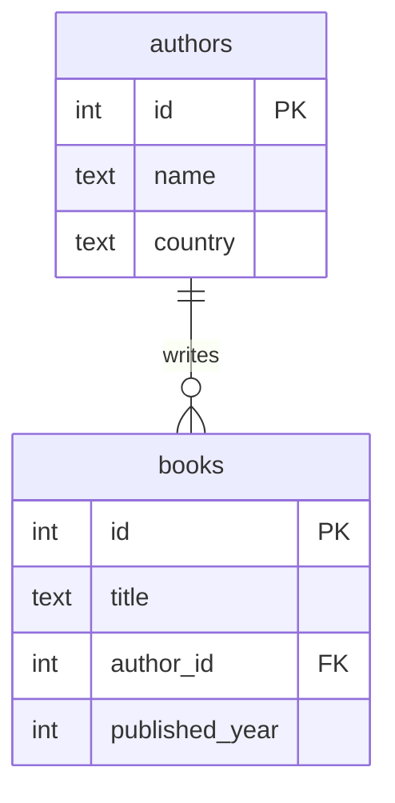

# 关系型数据库基础概念

关系型数据库把数据存进若干张**表**里，每张表是一份二维表格。表与表之间通过**主键 / 外键**建立关系，**索引**让查询更快，**schema** 是表的命名空间。本章只引入这些概念名词、定义、和看得见的 demo，不展开内部机制。

本模块在 `m_relational_basics` schema 下预置了两张表：`authors`（4 行）和 `books`（8 行，其中一行 `published_year IS NULL`）。每个示例点右下角"运行"会真正执行——drizzle pane 是同一语义的 drizzle-orm 写法。

## 1. 表、行、列

**表**是一份二维数据集合：横向的**行**是一条条记录，纵向的**列**是字段，每列有名字和类型。同一张表里所有行的列结构完全一致——列定义在表上，不在行上。表本身属于某个 **schema**（命名空间，第 4 节展开）。

### 语法骨架

```text
CREATE TABLE <table> (
  <column>  <type> [<column-constraint> ...],
  <column>  <type> [<column-constraint> ...],
  ...
);
```

- `<table>`：表名
- `<column>`：列名
- `<type>`：列的数据类型，如 `integer` / `text` / `timestamptz` / `boolean`
- `<column-constraint>`：列级约束，如 `NOT NULL` / `PRIMARY KEY` / `REFERENCES <table>(<col>)`

:::example{id="inspect-table-shape"}

:::example{id="inspect-columns"}

:::example{id="count-rows"}

## 2. 主键、外键

**主键**是一列（或几列），用来唯一标识表里的一行——值不能重复，也不能为 NULL。**外键**是一列，它的值必须出现在另一张表的主键里，相当于指向另一张表某行的「指针」。PG 在写入时强制检查外键值存在，从而保证表之间的关联始终有效。两者组合起来，主键表达「这是哪个实体」，外键表达「实体之间的关系」。

### 语法骨架

```text
CREATE TABLE <table> (
  <pk-col>  <type> PRIMARY KEY,
  <fk-col>  <type> REFERENCES <other-table>(<other-pk-col>),
  ...
);
```

- `<pk-col>`：主键列，常用 `serial` / `bigserial` 自增整型
- `REFERENCES <other-table>(<other-pk-col>)`：声明本列指向另一张表的主键
- 一张表可以没有主键，但教学里始终给主键
- 外键引用的列必须是另一张表的主键或 UNIQUE 列



:::example{id="pk-violation"}

:::example{id="fk-insert-ok"}

:::example{id="fk-violation"}

:::example{id="inspect-constraints"}

## 3. 索引

**索引**是建在表上的一个独立查找结构，让"按某列找行"不用扫全表。主键列上 PG 会自动建一个索引；其他列要查得快，需要显式 `CREATE INDEX`。索引只加速定位、不改变表里的数据：删掉索引数据还在，重新建索引数据也不会变。索引类型（B-tree / Hash / GIN / ...）的选型本章不展开，默认 B-tree 即可。

### 语法骨架

```text
CREATE INDEX [IF NOT EXISTS] <index-name>
ON <table> (<column> [, <column> ...]);

DROP INDEX [IF EXISTS] <index-name>;
```

- `<index-name>`：索引名，本 schema 内唯一
- `<table> (<column>)`：在哪张表的哪一列上建
- `IF NOT EXISTS` / `IF EXISTS`：让脚本可重复执行
- 索引是 schema 级对象，和表平行存在

:::example{id="inspect-default-index"}

:::example{id="create-index-on-title"}

:::example{id="index-is-separate-object"}

## 4. Schema — 命名空间

一个 PG 数据库里可以同时存在多个 **schema**，schema 是表 / 索引 / 视图 / 函数等对象的命名空间。`a.users` 和 `b.users` 是两张完全独立的表，互不影响。写 SQL 时不带前缀（`SELECT * FROM users`），PG 会按当前的 **search_path** 顺序找第一个命中的 schema。本课程每个章节模块隔离在一个 `m_<slug>` 的 schema 下，执行示例前 search_path 已被设为 `m_<slug>, pg_catalog`。

### 语法骨架

```text
CREATE SCHEMA <schema-name>;

SET search_path = <schema-name> [, <schema-name> ...];

SELECT ... FROM <schema-name>.<table>;   -- 跨 schema 显式限定
```

- `<schema-name>`：schema 名，库内唯一
- `SET search_path`：决定不带前缀的表名去哪些 schema 找，按列出顺序
- `<schema-name>.<table>`：完全限定写法，绕开 search_path

:::example{id="list-schemas"}

:::example{id="current-schema-of-this-module"}

:::example{id="qualified-vs-unqualified"}
