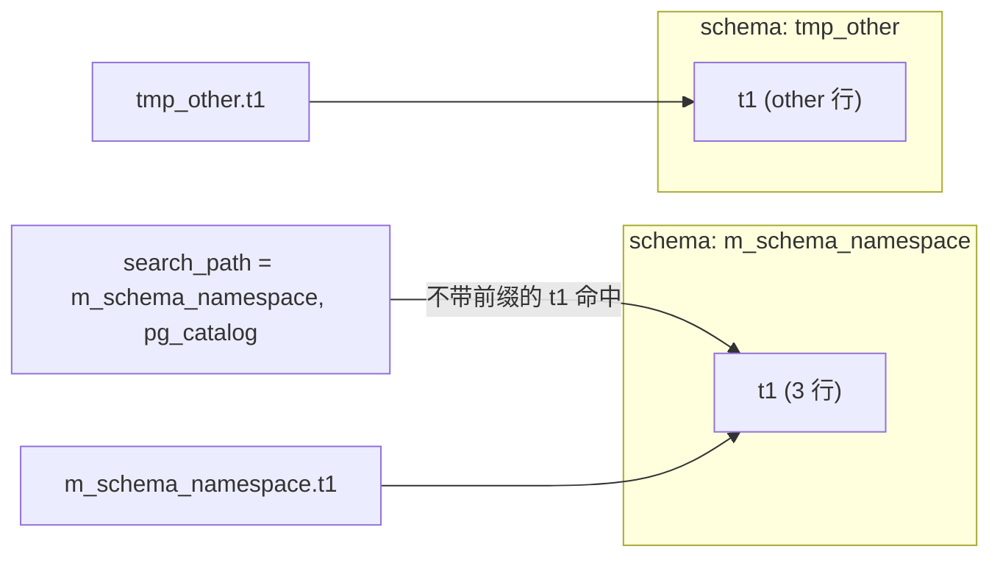

# Schema 与命名空间

第 1 章 Section 4 已经引入过 schema 这个名词。本章深化：怎么建、怎么删、`search_path` 如何决定不带前缀的表名解析到哪里，以及不同 schema 里同名表如何并存。

本模块在 `m_schema_namespace` schema 下预置了一张表 `t1`（3 行）。Example 里会临时建一个 `tmp_other` schema 演示对比，每个写操作 example 自带清理，事务回滚后 `tmp_other` 不会泄漏到下一次运行。

## 1. CREATE / DROP — 建与删 schema

`CREATE SCHEMA <name>` 在当前数据库里建一个新的命名空间，`DROP SCHEMA <name>` 删掉它。schema 是表 / 视图 / 函数 / 序列 / 类型这些对象的容器，本身不存数据。删 schema 时如果里面还有对象，PG 默认拒绝；加 `CASCADE` 会连同 schema 内所有对象一起删。

### 语法骨架

```text
CREATE SCHEMA [IF NOT EXISTS] <name>;

DROP SCHEMA [IF EXISTS] <name> [CASCADE];
```

- `<name>`：schema 名，库内唯一
- `IF NOT EXISTS` / `IF EXISTS`：让脚本可重复执行
- `CASCADE`：连带删 schema 内的所有对象；不加时若非空则报错

:::example{id="create-tmp-schema"}

:::example{id="drop-tmp-schema-cascade"}

## 2. search_path — 未限定名的解析顺序

写 `SELECT * FROM t1` 不带 schema 前缀时，PG 按当前 `search_path` 里的 schema 顺序查找，第一个命中的就是结果。`search_path` 默认是 `"$user", public`。`SET LOCAL search_path TO <a>, <b>` 改当前事务的查找路径，事务结束后回到原值。本课程的 `/exec` 端点在每次运行 example 前已经 `SET LOCAL search_path = m_schema_namespace, pg_catalog`，所以不加前缀的 `t1` 默认指向本模块的表。

### 语法骨架

```text
SHOW search_path;

SET LOCAL search_path TO <schema> [, <schema> ...];
```

- `SHOW search_path`：查看当前生效的查找路径
- `SET LOCAL`：只影响当前事务，事务结束自动恢复
- `<schema>`：按顺序排列，前面的优先

:::example{id="show-current-search-path"}

:::example{id="change-search-path-effect"}

## 3. 跨 schema 引用与同名冲突

完整限定写法 `<schema>.<table>` 总是直接定位到某个 schema 里的对象，绕开 `search_path`。不同 schema 可以有同名的表、视图、函数，互不影响。如果一个名字在多个 schema 都存在，不带前缀时 `search_path` 里最先列出的那个胜出。

### 语法骨架

```text
SELECT ... FROM <schema>.<table>;

-- 同名 t1 在两个 schema 里独立存在：
SELECT val FROM m_schema_namespace.t1;
SELECT val FROM tmp_other.t1;
```

- `<schema>.<table>`：完全限定，最明确
- 同名表分布在不同 schema 时只能靠前缀区分
- 跨 schema 的 JOIN / UNION 完全合法，PG 把 schema 当目录看待



:::example{id="qualified-name-cross-schema"}

:::example{id="list-tables-by-schema"}
