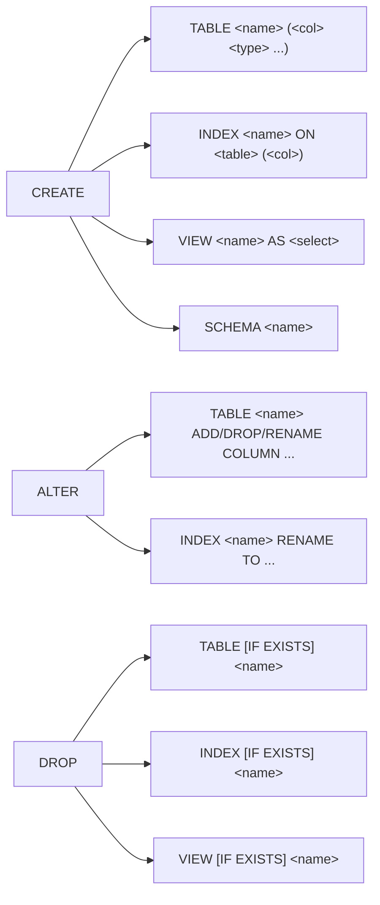

# SQL 基础语法

SQL 是和关系型数据库交互的声明式语言。按动作意图划分为四大类：**DDL** 改结构、**DML** 改数据、**DQL** 读数据、**DCL** 改权限。本章按这四类分节，每节给出该类的语法骨架和最小可运行示例——具体子句细节（WHERE / JOIN / 子查询 / 各种 INSERT 形态）由后续章节展开。

本模块在 `m_sql_syntax` schema 下预置了一张 `employees` 表（10 行，3 个 dept），用于演示 DDL 的临时副表、DQL 的分组聚合、DCL 的权限授予。

## 1. DDL — CREATE / ALTER / DROP

**DDL**（Data Definition Language）改的是「结构」而非「数据」。三个核心动词：`CREATE` 创建对象、`ALTER` 修改对象、`DROP` 删除对象。作用对象是数据库里的 schema 级实体——`TABLE` / `INDEX` / `VIEW` / `SEQUENCE` / `SCHEMA` 等。DDL 语句执行后表的定义本身发生变化，不像 DML 那样只是行的增减。

### 语法骨架



- `CREATE`：新建对象，加 `IF NOT EXISTS` 让脚本可重复执行
- `ALTER`：在已有对象上做增删改（加列、改名、改类型）
- `DROP`：删除对象，加 `IF EXISTS` 让脚本可重复执行
- 作用对象本节聚焦 `TABLE`；`INDEX` 见第 1 章，`VIEW` / `SCHEMA` 后续章节展开

下面用一张临时副表 `employees_archive` 演示 DDL 完整生命周期，避免污染主表 `employees`。

:::example{id="ddl-create-table"}

:::example{id="ddl-alter-add-column"}

:::example{id="ddl-alter-rename-column"}

:::example{id="ddl-drop-table"}

## 2. DML — INSERT / UPDATE / DELETE

**DML**（Data Manipulation Language）改的是「数据」而非「结构」。`INSERT` 写入新行、`UPDATE` 修改已有行、`DELETE` 删除行。语句执行后表结构不变，只是表里的行集合发生变化。本节只给「最小一行 SQL」对照展示，详细子句（多行插入、`ON CONFLICT`、`RETURNING`、`WHERE` 各种谓词）见 `basic/curd` 模块。

### 语法骨架

```text
INSERT INTO <table> (<cols>) VALUES (<values>);

UPDATE <table> SET <col> = <expr> WHERE <predicate>;

DELETE FROM <table> WHERE <predicate>;
```

- `<table>`：目标表名
- `INSERT`：写入一行（或多行），列与值按位置对应
- `UPDATE`：用表达式给列赋新值，`WHERE` 限定哪些行受影响
- `DELETE`：删除满足 `WHERE` 的行；省略 `WHERE` 会删空整张表

:::example{id="dml-insert-min"}

:::example{id="dml-update-min"}

:::example{id="dml-delete-min"}

## 3. DQL — SELECT 的全貌

**DQL**（Data Query Language）只有一个动词 `SELECT`，从一张或多张表里读取行。子句顺序固定：`SELECT` → `FROM` → `WHERE` → `GROUP BY` → `HAVING` → `ORDER BY` → `LIMIT`。语句执行后不修改任何数据，只返回一个结果集合。本节展示「带分组聚合的完整形态」，更多单子句 demo 见 `basic/curd`。

### 语法骨架

```text
SELECT    <columns>
FROM      <table>
[WHERE    <row-predicate>]
[GROUP BY <key>]
[HAVING   <group-predicate>]
[ORDER BY <key> [ASC/DESC]]
[LIMIT    <n>];
```

- `<columns>`：列名、表达式、聚合函数（`count(*)` / `avg(salary)`）
- `WHERE`：在分组前过滤行
- `GROUP BY`：按列把行分成若干组
- `HAVING`：在分组后过滤组（不能用 `WHERE` 过滤聚合结果）
- `ORDER BY` / `LIMIT`：排序和截取

:::example{id="dql-group-having"}

:::example{id="dql-order-limit"}

## 4. DCL — GRANT / REVOKE

**DCL**（Data Control Language）改的是「权限」。`GRANT` 把某权限授予某角色、`REVOKE` 收回。作用主体是 PG 的**角色**（ROLE，可以是用户也可以是组）。本节演示「创建只读角色 → 授予 SELECT → 验证 → 收回」的最小闭环；权限继承、行级安全（RLS）、列级权限等高级话题见第 15 章。

### 语法骨架

```text
GRANT  <privilege> ON <object> TO   <role>;

REVOKE <privilege> ON <object> FROM <role>;
```

- `<privilege>`：`SELECT` / `INSERT` / `UPDATE` / `DELETE` / `ALL PRIVILEGES`
- `<object>`：表、视图、schema、sequence、function 等
- `<role>`：用 `CREATE ROLE` 提前创建的角色名
- `REVOKE` 形参和 `GRANT` 完全对称，只是介词 `TO` 换成 `FROM`

:::example{id="dcl-create-role"}

:::example{id="dcl-grant-select"}

:::example{id="dcl-inspect-grants"}

:::example{id="dcl-revoke-select"}
