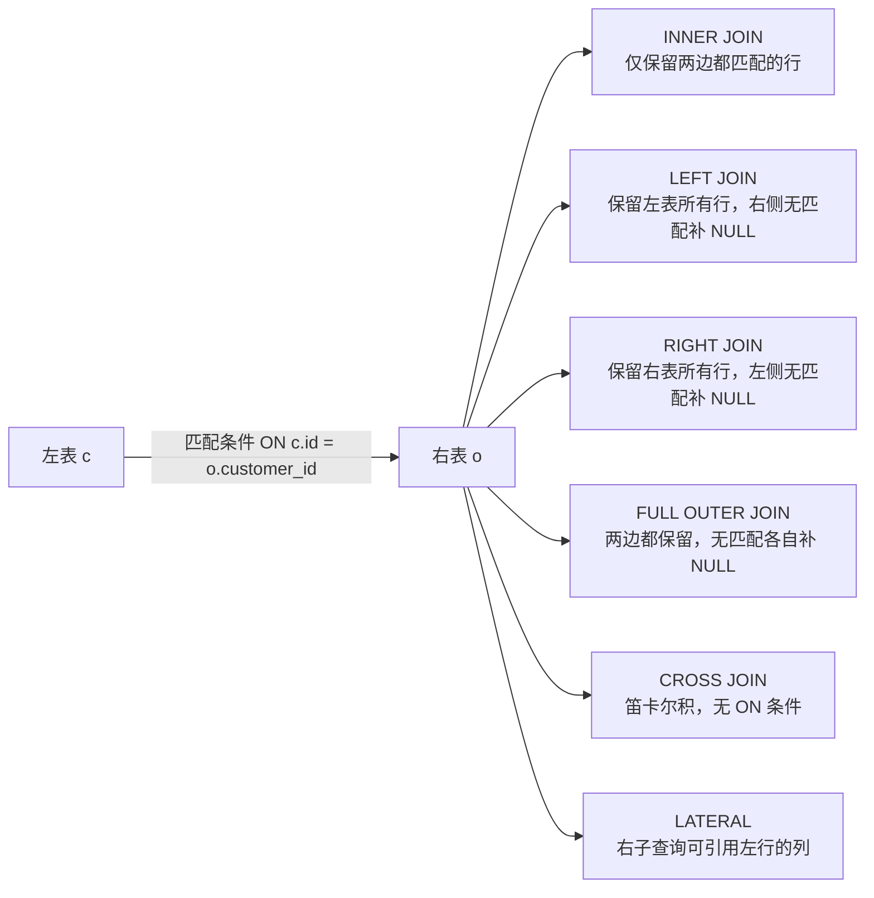
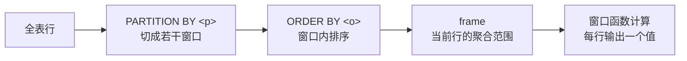

# 高级查询

基础 CRUD 之上，真实业务大多需要跨表、嵌套、分组、排名。本章把这些手法分六节摆出：JOIN 把多表拼成一张大表、子查询把 SELECT 嵌进 SELECT、EXISTS/IN/ANY/ALL 表达「集合存在性」、UNION/INTERSECT/EXCEPT 在结果集上做并交差、CTE 给中间查询命名甚至递归、窗口函数在不折叠行的前提下按分区计算。

本模块在 `m_advanced_query` schema 下预置了三张表：`customers`（6 行，分三个 region，其中 Frank 完全没下单）、`products`（5 行，价格 10~1000）、`orders`（25 行，覆盖多种客户 × 产品组合，时间分布在 2024-01..03）。JOIN 算法、CTE 优化栅栏、窗口函数性能这些属于执行计划话题，留给后续章节展开。

## 1. JOIN — 多表拼接

JOIN 把两张（或多张）表按一个匹配条件拼接成更宽的一张结果表。SQL 提供六种 JOIN，区别只在「左表 / 右表里不匹配的行怎么办」：INNER 全部丢弃、LEFT 保留左表多余行（右侧补 NULL）、RIGHT 保留右表多余行、FULL OUTER 两边都保留、CROSS 直接做笛卡尔积不需要条件、LATERAL 让右侧子查询能引用左侧每一行。

### 语法骨架



- INNER：最常用，等价于 `JOIN`（不加修饰词时默认 INNER）
- LEFT / RIGHT：保留某一侧全部行；`LEFT JOIN ... WHERE r.id IS NULL` 是查「左表里没匹配上右表的行」的惯用写法
- FULL OUTER：左右都保留，外键完整性高的库里这种行少见
- CROSS：无 `ON` 子句；常用于生成所有组合（如「每个客户 × 每个产品」可能性矩阵）
- LATERAL：用 `JOIN LATERAL (SELECT ... WHERE col = outer.col) sub ON true`，让子查询每行重新算一次

:::example{id="join-inner"}

:::example{id="join-left-find-no-orders"}

:::example{id="join-full"}

:::example{id="join-cross"}

:::example{id="join-lateral"}

## 2. 子查询与相关子查询

子查询是嵌在另一个 SELECT 里的 SELECT。按返回形状分三类：标量子查询返回单值，可以出现在 `SELECT` 列表或 `WHERE` 的比较右侧；集合子查询返回多行，常配 `IN / EXISTS / ANY / ALL`；派生表是放在 `FROM` 里的子查询，被当作一张匿名表使用。如果内层 SELECT 引用了外层的列，叫**相关子查询**——内层会被外层每行触发一次重新求值。

### 语法骨架

```text
-- 出现在 SELECT 列表（标量）
SELECT col, (SELECT <expr> FROM <inner> WHERE ...) AS alias FROM <outer>;

-- 出现在 WHERE（集合 / 标量）
SELECT col FROM <outer>
WHERE <col> <op> (SELECT <expr> FROM <inner> WHERE ...);

-- 出现在 FROM（派生表）
SELECT ... FROM (SELECT ... FROM ... GROUP BY ...) <alias>
WHERE ...;
```

- 标量子查询：必须保证返回 1 行 1 列；返回多行运行时报错
- 集合子查询：常和 `IN / EXISTS / ANY / ALL` 搭配（下一节）
- 派生表：必须给一个 `<alias>`，否则 SQL 语法错误
- 相关子查询：内层 SELECT 里出现 `<outer>.<col>` 就是相关，按外层每一行触发求值

:::example{id="subquery-scalar"}

:::example{id="subquery-derived"}

:::example{id="subquery-correlated"}

## 3. EXISTS / IN / ANY / ALL — 集合存在性

四种谓词都接子查询，但语义不同：`EXISTS` 看子查询是否至少有一行；`IN` 看某个值是否在子查询返回的集合里；`ANY` 把比较运算符（`>`、`<`、`=` ...）逐项和集合元素比，**有一个为真**即真；`ALL` 同样逐项比，**全部为真**才真。`= ANY` 等价于 `IN`、`<> ALL` 等价于 `NOT IN`，但前者对 NULL 行为更可控。

### 语法骨架

```text
WHERE EXISTS    (SELECT 1   FROM <inner> WHERE <col> = <outer>.<col>);
WHERE <col> IN  (SELECT <col> FROM <inner> WHERE ...);
WHERE <col> <op> ANY (SELECT <col> FROM <inner> WHERE ...);
WHERE <col> <op> ALL (SELECT <col> FROM <inner> WHERE ...);
```

- `EXISTS`：子查询返回任意一行就为真；典型相关子查询写法
- `IN`：值 = 集合中任意元素；空集合返回 false
- `ANY` / `ALL`：`<op>` 是 `=` / `<>` / `<` / `>` / `<=` / `>=` 任一比较运算符
- 大数据集下 `EXISTS` 通常优于 `IN`（PG 一般能转成 semi-join），但 v1 阶段先记语义、性能留给后续章节

:::example{id="exists-customers-with-orders"}

:::example{id="in-products-ordered"}

:::example{id="any-price-greater"}

## 4. 集合运算 — UNION / INTERSECT / EXCEPT

集合运算把两个结果集按行做并 / 交 / 差。`UNION` 取并集并去重，`UNION ALL` 不去重（更快，结果是简单堆叠）；`INTERSECT` 取交集；`EXCEPT` 取差集（左 - 右）。三种运算都要求左右两侧的列数一致、对应列的类型可兼容；结果列名取自左侧。

### 语法骨架

```text
<select-A> UNION     [ALL] <select-B>;
<select-A> INTERSECT [ALL] <select-B>;
<select-A> EXCEPT    [ALL] <select-B>;
```

- `<select-A>` / `<select-B>`：两个 SELECT，列数 / 类型对齐
- `ALL`：保留重复行；不写 `ALL` 默认去重
- 结果集的列名 = `<select-A>` 的列名
- 多段时按从左到右结合，可用括号显式分组

:::example{id="union-all-vs-union"}

:::example{id="intersect-customers-buying-a-and-b"}

:::example{id="except-customers-no-orders"}

## 5. CTE — WITH 与递归

CTE（Common Table Expression）用 `WITH <name> AS (...)` 给一个子查询起名，主查询里像表一样引用。作用是切分逻辑、避免重复书写复杂子查询。`WITH RECURSIVE` 允许 CTE 在定义里引用自身，结构固定为「锚点 SELECT + UNION ALL + 递归项 SELECT」，典型用法是生成序列或遍历树形数据。

### 语法骨架

```text
-- 普通 CTE
WITH <name> AS (
  <inner-select>
)
SELECT ... FROM <name> ...;

-- 递归 CTE
WITH RECURSIVE <name>(<cols>) AS (
  <anchor-select>          -- 锚点：递归的起点
  UNION ALL
  <recursive-select>       -- 递归项：引用 <name> 自身
)
SELECT ... FROM <name>;
```

- `<name>`：CTE 名字，同 WITH 块里唯一
- 普通 CTE：在主查询里像表一样用，可在 `FROM` / `JOIN` 中引用
- `RECURSIVE`：必须有锚点 + UNION ALL + 递归项三段

```mermaid
flowchart TB
  ANCHOR["1&#46; 锚点 SELECT<br/>生成种子行（如 SELECT 1）"]
  REC["2&#46; 递归项 SELECT<br/>引用 &lt;name&gt; 自身<br/>每轮拿上轮的新行作输入"]
  STOP["3&#46; 终止条件<br/>递归项返回 0 行时停止"]
  OUT["主查询<br/>读 &lt;name&gt; 的累积结果"]
  ANCHOR -->|"UNION ALL"| REC
  REC -->|"产生新行"| REC
  REC --> STOP
  STOP --> OUT
```

- 递归项里 `<name>` 引用上一轮新增的行，直到没有新行才停止



:::example{id="cte-basic"}

:::example{id="cte-recursive-series"}

## 6. 窗口函数

窗口函数按 `OVER (...)` 定义的「窗口」聚合，但**不折叠行**——每个输入行都对应一个输出行，多出一列是窗口算出的结果。`PARTITION BY` 把行分组，`ORDER BY` 在组内排序，窗口函数沿这个顺序计算。常见类别：排名（`row_number / rank / dense_rank`）、相邻取值（`lag / lead`）、聚合（`sum / avg` 配 OVER 变累计或移动平均）。

### 语法骨架

```text
<window-func>() OVER (
  [PARTITION BY <p>]
  [ORDER BY     <o> [ASC/DESC]]
  [<frame>]
)
```

- `<window-func>`：`row_number()` / `rank()` / `dense_rank()` / `lag(col)` / `lead(col)` / `sum(col)` ...
- `PARTITION BY`：按 `<p>` 分窗口；不写则整张表是一个窗口
- `ORDER BY`：窗口内排序；排名 / `lag`/`lead` / 累计 SUM 都依赖这个顺序
- `<frame>`：明确「当前行的哪一段是聚合范围」，如 `ROWS BETWEEN UNBOUNDED PRECEDING AND CURRENT ROW`（默认值视函数而定）



- RANK 在并列时跳号（1,1,3,...），DENSE_RANK 不跳号（1,1,2,...）
- `lag(col, n)` 取当前行之前第 n 行的同列值；`lead` 同理取之后
- `sum(col) OVER (PARTITION BY ... ORDER BY ...)` 默认 frame = 起点到当前行 = 累计和

:::example{id="window-row-number"}

:::example{id="window-rank-dense"}

:::example{id="window-lag-diff"}

:::example{id="window-running-sum"}
