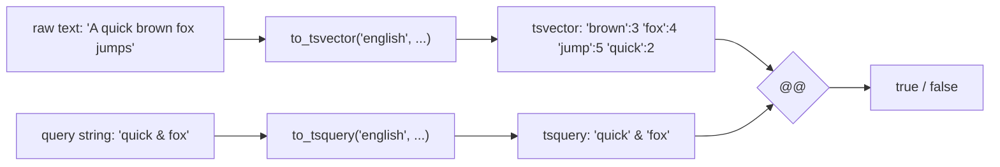

# 全文搜索

PostgreSQL 内置一套全文搜索（FTS）能力：把文档切词、去停用词，得到 `tsvector`；用户的检索串解析为 `tsquery`；`@@` 操作符判断"这个文档是否匹配这个查询"。配合 `tsvector` 列上的 GIN 索引，可以在百万行级别表上做毫秒级关键词检索。

本模块在 `m_full_text_search` schema 下预置了一张 `articles` 表（8 行英文短文，主题覆盖 postgres / index / jsonb / mvcc 等），表里有一个 `tsv tsvector GENERATED ALWAYS AS (...) STORED` 列——title 和 body 的切词结果自动物化。下文 example 围绕这张表展开。

## 1. tsvector 与 tsquery — 文档与查询

`tsvector` 是一个文档的切词结果：原文经过分词、归一化（lowercase、stemming）、去停用词后得到的「词位 + 位置」集合。`tsquery` 是检索表达式，支持 `&`（AND）、`|`（OR）、`!`（NOT）、`<->`（紧邻）。`@@` 是匹配操作符：左 `tsvector` 右 `tsquery`，返回布尔值。`to_tsvector(config, text)` 和 `to_tsquery(config, text)` 是把字符串转成这两种类型的入口函数，`config` 决定用哪套分词规则（`'english'`、`'simple'`、...）。

### 语法骨架

```text
SELECT to_tsvector('<config>', '<document>')
       @@
       to_tsquery('<config>', '<query>');
```

- `<config>`：文本搜索配置，决定分词器和停用词表。常用 `'english'`、`'simple'`
- `<document>`：原文字符串
- `<query>`：`tsquery` 表达式，词之间用 `&` / `|` 连接，`!` 取反，`<->` 表示紧邻



:::example{id="tsvector-basic"}

:::example{id="tsquery-basic"}

:::example{id="match-operator"}

## 2. 查询解析器 — to_tsquery / plainto / phraseto / websearch

把人类输入的检索串转成 `tsquery` 有四个函数，区别在于"对输入有多宽容"。`to_tsquery` 最严格——输入必须是合法的 `tsquery` 表达式（带 `&` / `|` / `!`），不合法直接报错。`plainto_tsquery` 接受自然句子，按空格切词后用 `&` 串起来。`phraseto_tsquery` 同样切词，但用 `<->` 串起来，要求保持词序。`websearch_to_tsquery` 接受 Google 风格输入：双引号短语、`-` 排除、`or` 关键字。

### 语法骨架

```text
to_tsquery       ('english', 'quick & fox & !lazy')   -- 严格表达式
plainto_tsquery  ('english', 'quick fox lazy')        -- 全部 AND
phraseto_tsquery ('english', 'quick brown fox')       -- 保持词序 (<->)
websearch_to_tsquery('english', '"quick fox" -lazy')  -- Google 风格
```

- 四个函数返回值都是 `tsquery`，可直接用 `@@` 与 `tsvector` 匹配
- 用户输入由前端拼接时优先选 `websearch_to_tsquery`，它对非法字符容错
- `to_tsquery` 适合后端已经构造好的规范查询

:::example{id="plainto-tsquery"}

:::example{id="websearch-tsquery"}

## 3. 在表中做全文搜索 — 物化列 + GIN + WHERE @@

实战做法：给表加一个 `tsvector GENERATED ALWAYS AS (...) STORED` 列把切词结果物化；在该列上建 GIN 索引；查询时 `WHERE tsv @@ to_tsquery(...)`，PG 走 Bitmap Index Scan。排序按 `ts_rank(tsv, query)` 给出相关性分。`articles` 表的 `tsv` 列在 seed 里已经建好，下面 example 直接用。

### 语法骨架

```text
-- 1. 表上挂一个 GENERATED tsvector 列（建表时一次性写好）
ALTER TABLE <table>
  ADD COLUMN tsv tsvector
  GENERATED ALWAYS AS (to_tsvector('english', <col1> || ' ' || <col2>)) STORED;

-- 2. 在 tsvector 列上建 GIN 索引
CREATE INDEX <idx-name> ON <table> USING gin (tsv);

-- 3. 查询走 @@ + ORDER BY ts_rank
SELECT <cols>, ts_rank(tsv, q) AS rank
FROM   <table>, to_tsquery('english', '<query>') q
WHERE  tsv @@ q
ORDER BY rank DESC;
```

- `<table>` / `<col1>` / `<col2>`：被搜索的表和参与切词的文本列
- `<idx-name>`：GIN 索引名，schema 内唯一
- `USING gin`：GIN（Generalized Inverted iNdex）是 tsvector 的标准索引类型
- `ts_rank(tsv, q)`：返回相关性得分，越大越相关

:::example{id="search-articles"}

:::example{id="search-with-rank"}

:::example{id="gin-on-tsvector"}

## 4. 高亮与摘要 — ts_headline

`ts_headline(config, document, query)` 对原文做高亮——返回一段含 `<b>...</b>` 标记的片段，命中的词位被包起来。适合搜索结果页的摘要展示。它不走索引，必须在结果集已经过滤完后逐行调用，所以正确姿势是先用 `WHERE tsv @@ q` 把候选行缩到小集合，再对小集合套 `ts_headline`。

### 语法骨架

```text
SELECT id,
       ts_headline('<config>', <text-col>, q,
                   '<options>')
FROM   <table>, to_tsquery('<config>', '<query>') q
WHERE  tsv @@ q;
```

- `<text-col>`：用来做高亮的原文列（通常是 body，而不是 tsvector）
- `<options>`：可选字符串，控制片段长度、标签等。常用 `'StartSel=<b>, StopSel=</b>, MaxFragments=2, MaxWords=15, MinWords=5'`
- `ts_headline` 默认就用 `<b></b>` 包裹，所以最简形式可以省略 options 参数

:::example{id="headline-snippet"}

## 5. 中文分词 — 点到为止

PG 内置的 `english` 配置只认空格 + 标点分词，对中文无效；`simple` 配置不做语言相关处理，对中文会按整段字符当成一个 token，几乎不可用。要在 PG 里真正分中文，需要装 `zhparser`、`pg_jieba` 这类扩展，注册一个新的文本搜索配置（如 `chinese_zh`），然后 `to_tsvector('chinese_zh', '...')`。本课程只演示「不分词时中文 tsvector 长什么样」，扩展的安装与配置在生产文档里。

### 语法骨架

```text
-- 不装扩展，用 PG 内置配置直接切中文（看不到理想的分词）
SELECT to_tsvector('simple',  '我爱 PostgreSQL 数据库');

-- 安装 zhparser 后的预期写法（本环境未装，仅作对照）
-- CREATE EXTENSION zhparser;
-- CREATE TEXT SEARCH CONFIGURATION chinese_zh (PARSER = zhparser);
-- ALTER TEXT SEARCH CONFIGURATION chinese_zh
--   ADD MAPPING FOR n,v,a,i,e,l WITH simple;
-- SELECT to_tsvector('chinese_zh', '我爱 PostgreSQL 数据库');
```

- 第一段 SQL 在本环境可运行，但分词结果不符合中文使用预期
- 第二段是装扩展后的工作流概览，**不**在本课程环境执行

:::example{id="chinese-without-zhparser"}
