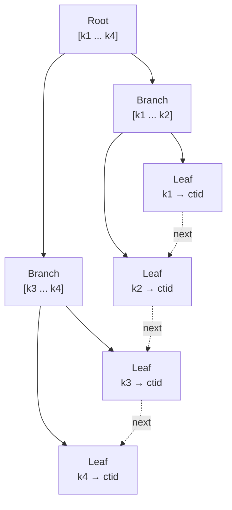

# 索引

索引是建在表上的独立查找结构，让按某列定位行不必扫全表。本章在 ch01 引入「索引是独立对象」的基础上，铺开 PG 内置的 5 种索引类型（B-tree / Hash / GIN / GiST / BRIN）和 4 种通用特性（部分 / 表达式 / 覆盖 / 唯一）。每节用 `EXPLAIN` 看计划里有没有出现对应的 Index Scan——只点到「走了索引」即止，执行计划节点的深入解读留到 ch17。

本模块在 `m_index` 下预置 `events`（1 万行，`ts` 横跨一年、`kind` 5 种、`payload` 是 jsonb、`tags` 是 text[]）和 `places`（50 行）。EXPLAIN 类 example 都把 `timeoutMs` 提到 30000。

## 1. B-tree — 默认类型

B-tree 是 `CREATE INDEX` 不指定 `USING` 时的默认类型，支持等值（`=`）、范围（`<` `<=` `>` `>=` `BETWEEN`）和 `ORDER BY`。叶节点按键值有序排列，PG 二分定位后顺序扫描即可拿到匹配行。主键约束会自动建一棵 B-tree。绝大多数标量列（整型、文本、时间戳）默认就选它。

### 语法骨架

```text
CREATE INDEX [IF NOT EXISTS] <name>
ON <table> [USING btree] (<column> [, <column> ...]);
```

- `<name>`：索引名，schema 内唯一
- `USING btree`：可省略，默认就是 btree
- `(<column>, ...)`：单列或多列；多列时左前缀有效



:::example{id="btree-create-and-explain"}

:::example{id="btree-range-scan"}

## 2. Hash — 仅等值

Hash 索引只支持等值（`=`），把键值哈希后映射到 bucket。PG 10 才补齐 WAL 支持（之前崩溃后会损坏），所以历史上很少用。对等值场景 B-tree 已经够快，实际工程很少专门建 Hash 索引——掌握它存在即可。

### 语法骨架

```text
CREATE INDEX [IF NOT EXISTS] <name>
ON <table> USING hash (<column>);
```

- `USING hash`：必须显式声明
- `(<column>)`：只能单列；不支持范围 / 排序 / 多列
- 适用谓词：仅 `<column> = <value>`

:::example{id="hash-create-and-explain"}

## 3. GIN — JSONB / 数组 / 全文

GIN（Generalized Inverted Index）是倒排索引：每个「元素」反向指向包含它的行集合。适合「列里装一个集合，问哪些行包含某元素」类查询——JSONB 的 `@>` / `?` / `?&` / `?|`、数组的 `@>` / `&&`、全文 `tsvector` 的 `@@` 都走 GIN。

### 语法骨架

```text
CREATE INDEX [IF NOT EXISTS] <name>
ON <table> USING gin (<column> [<opclass>]);
```

- `USING gin`：必须显式声明
- `<opclass>`：可选操作符族，常用：
  - `jsonb_ops`（默认，支持 `@>` `?` `?&` `?|`）
  - `jsonb_path_ops`（只支持 `@>`，但索引更小、查得更快）
  - `array_ops`（默认，text[] / int[] 自动用）

:::example{id="gin-jsonb"}

:::example{id="gin-array"}

## 4. GiST — 范围 / 几何

GiST（Generalized Search Tree）是通用搜索树，节点存「键的边界框」，子树存「落在框里的元素」。它服务那些需要「叠加 / 包含 / 距离」语义的查询：范围类型 `int4range` / `tsrange` 的 `&&`（重叠）、几何类型的 `<->`（距离）、PostGIS 的所有空间查询都靠 GiST。

### 语法骨架

```text
CREATE INDEX [IF NOT EXISTS] <name>
ON <table> USING gist (<column> [<opclass>]);
```

- `USING gist`：必须显式声明
- `<column>`：范围类型、几何类型、`tsvector`、PostGIS geometry 等
- 适用谓词：`&&`（重叠）、`<@`（包含于）、`@>`（包含）、`<->`（距离）

:::example{id="gist-range-overlap"}

## 5. BRIN — 超大有序表

BRIN（Block Range Index）只为每个连续的 block range（默认 128 个 page）记录一个 min/max 摘要。索引体积比 B-tree 小两个数量级，但只在数据**天然按索引列有序**时才有用——比如按时间追加的日志表、按 id 顺序写入的事实表。随机分布的列上 BRIN 几乎过滤不掉任何 block。

### 语法骨架

```text
CREATE INDEX [IF NOT EXISTS] <name>
ON <table> USING brin (<column>) [WITH (pages_per_range = <n>)];
```

- `USING brin`：必须显式声明
- `pages_per_range`：每个摘要覆盖多少 page，默认 128；越小过滤越细、索引越大
- 数据物理顺序与该列逻辑顺序高度相关时才用

:::example{id="brin-on-ts"}

:::example{id="brin-vs-btree-size"}

## 6. 索引特性 — 部分 / 表达式 / 覆盖 / 唯一

前 5 节讲的是索引「用什么数据结构」，这一节讲索引「索引谁、索引什么、附带什么」。这 4 个特性正交于索引类型——B-tree、GIN、GiST 上都可以叠加（具体哪种组合受支持以 PG 文档为准）。

### 语法骨架

```text
-- 部分索引：只索引满足谓词的行
CREATE INDEX [IF NOT EXISTS] <name> ON <table> (<col>) WHERE <predicate>;

-- 表达式索引：索引一个函数 / 表达式的返回值
CREATE INDEX [IF NOT EXISTS] <name> ON <table> (<expr>);

-- 覆盖索引：INCLUDE 把额外列带进叶子，供 Index Only Scan
CREATE INDEX [IF NOT EXISTS] <name> ON <table> (<key-col>) INCLUDE (<extra-col> [, ...]);

-- 唯一索引：UNIQUE 既是索引也是唯一约束
CREATE UNIQUE INDEX [IF NOT EXISTS] <name> ON <table> (<col>);
```

- 部分索引 `WHERE`：谓词必须是不可变（IMMUTABLE）表达式；只为热点子集省空间
- 表达式索引 `<expr>`：查询时谓词必须长得**一模一样**（如索引 `lower(kind)`，查询也得写 `lower(kind) = ...`）
- 覆盖索引 `INCLUDE`：附加列只放叶节点、不参与排序键；目标是触发 Index Only Scan
- 唯一索引：等价于一条 `UNIQUE` 约束，重复值写入返回 SQLSTATE 23505

:::example{id="partial-index"}

:::example{id="expression-index"}

:::example{id="covering-index"}

:::example{id="unique-index-as-constraint"}
