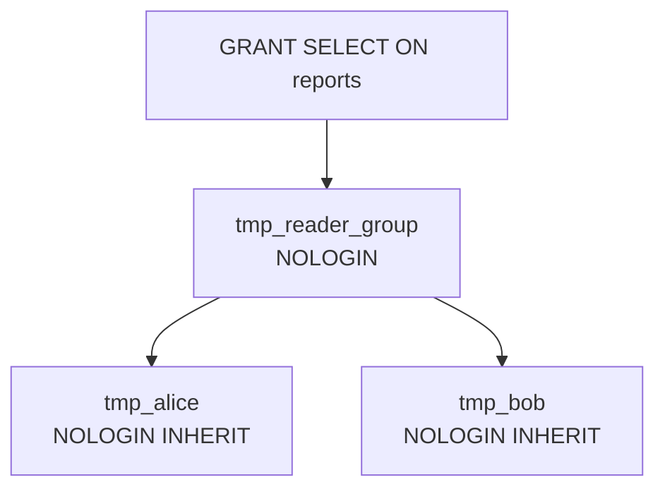

# 权限与安全

PostgreSQL 用 **role** 统一表达「用户」和「群组」，用 **GRANT / REVOKE** 控制谁能对哪些对象做什么操作，再用 **RLS（行级安全）** 把控制粒度下放到单行。本章在 `m_permission` schema 下预置了一张 `reports` 表（6 行，其中 2 行 `sensitive = true`），用来演示这套机制。

本课后端连接用的是非超管 `app` role，所以下面演示的 role 切换都是 `SET ROLE` 临时切到 `app` 创建的子 role，而不是真正换连接。每个 example 末尾会清理掉自己建的 role / policy。

## 1. role 与 user

PG 里**没有独立的 user 概念**——`CREATE USER` 只是 `CREATE ROLE ... LOGIN` 的别名。一个 role 可以拥有对象、被 GRANT 权限、继承别的 role；带 `LOGIN` 属性的 role 才能拿来连数据库。`current_user` / `current_role` 是当前生效身份（受 `SET ROLE` 影响），`session_user` 是连接时登录的身份（`SET ROLE` 不影响它）。

### 语法骨架

```text
CREATE ROLE <name> [LOGIN] [PASSWORD '<pwd>'] [NOLOGIN] [INHERIT|NOINHERIT];

DROP ROLE [IF EXISTS] <name>;
```

- `<name>`：role 名，库内唯一
- `LOGIN` / `NOLOGIN`：能否作为登录身份；群组 role 一般 `NOLOGIN`
- `PASSWORD`：仅 LOGIN role 需要
- `INHERIT`（默认）：被 GRANT 别的 role 时直接继承其权限；`NOINHERIT` 则要显式 `SET ROLE` 才能用
- PG **没有** `CREATE ROLE IF NOT EXISTS`，需要 `DO $$ ... pg_roles ... $$` 包一层判断

:::example{id="whoami"}

:::example{id="create-temp-role"}

## 2. GRANT 与 REVOKE

`GRANT` 把对象上的某项权限交给一个 role，`REVOKE` 反向收回。表级权限包括 `SELECT` / `INSERT` / `UPDATE` / `DELETE` / `TRUNCATE` / `REFERENCES` / `TRIGGER`；`SELECT` / `INSERT` / `UPDATE` 还可以细到列级。`WITH GRANT OPTION` 让被授权方有权再转授给别人。授权信息能在 `information_schema.role_table_grants`（表级）和 `information_schema.column_privileges`（列级）里查到。

### 语法骨架

```text
GRANT  <priv>[, ...] [ (<col>[, ...]) ]
       ON <object>
       TO <role>
       [WITH GRANT OPTION];

REVOKE <priv>[, ...] [ (<col>[, ...]) ]
       ON <object>
       FROM <role>;
```

- `<priv>`：`SELECT` / `INSERT` / `UPDATE` / `DELETE` / `TRUNCATE` / `REFERENCES` / `TRIGGER` / `ALL`
- `(<col>[, ...])`：列级授权（仅 `SELECT` / `INSERT` / `UPDATE` 支持）
- `<object>`：`TABLE <name>` / `SCHEMA <name>` / `SEQUENCE <name>` / `DATABASE <name>` 等
- `WITH GRANT OPTION`：让 `<role>` 可以再把这项权限授给别人
- 跨 schema 访问表时，role 还需要那个 schema 的 `USAGE` 权限

:::example{id="grant-select-and-verify"}

:::example{id="column-level-grant"}

:::example{id="set-role-test"}

## 3. role 继承

把 role A `GRANT` 给 role B，B 就成了 A 的成员；如果 B 是 `INHERIT`（默认），B 在做任何操作时都自动叠加 A 的权限，无需 `SET ROLE`。实践上的标准用法是：建一个 `NOLOGIN` 的群组 role 作为权限容器（如 `reader_group`），再把它授予若干个真人 role，所有权限挂在群组上一处维护。

### 语法骨架

```text
GRANT <parent_role> TO <child_role>;

REVOKE <parent_role> FROM <child_role>;
```

- `<parent_role>`：被加入的 role（通常是群组）
- `<child_role>`：成为成员的 role
- `<child_role>` 的 `INHERIT` 属性决定是否自动叠加 `<parent_role>` 的权限
- 同一个 role 可以同时是多个 parent 的成员



:::example{id="role-inheritance"}

## 4. 行级安全（RLS）

`ALTER TABLE ... ENABLE ROW LEVEL SECURITY` 给一张表打开行级过滤；一旦开启，对非表主、非超管的 role，**默认拒绝所有行**，直到 `CREATE POLICY` 显式声明哪些行可见 / 可改。policy 是一个 `USING (<predicate>)`（决定哪些行能 SELECT/UPDATE/DELETE 看到）+ 可选的 `WITH CHECK (<predicate>)`（决定 INSERT/UPDATE 后新行是否合法）的组合。典型场景：多租户隔离、按用户筛数据。

### 语法骨架

```text
ALTER TABLE <table> ENABLE ROW LEVEL SECURITY;

CREATE POLICY <policy_name> ON <table>
  [FOR { SELECT | INSERT | UPDATE | DELETE | ALL }]
  [TO <role>[, ...]]
  [USING (<row-filter-predicate>)]
  [WITH CHECK (<new-row-predicate>)];

DROP POLICY [IF EXISTS] <policy_name> ON <table>;
ALTER TABLE <table> DISABLE ROW LEVEL SECURITY;
```

- `<policy_name>`：policy 名，同一张表上唯一
- `FOR ...`：限定 policy 对哪类语句生效，省略即 `ALL`
- `TO <role>`：限定 policy 只对哪些 role 生效，省略即 `PUBLIC`
- `USING`：读 / 修改时判断哪些行可见
- `WITH CHECK`：写入 / 修改后判断新行是否合法
- 表的 owner 默认绕过 RLS；想强制 owner 也走 RLS 要 `ALTER TABLE ... FORCE ROW LEVEL SECURITY`

:::example{id="rls-enable-and-policy"}
