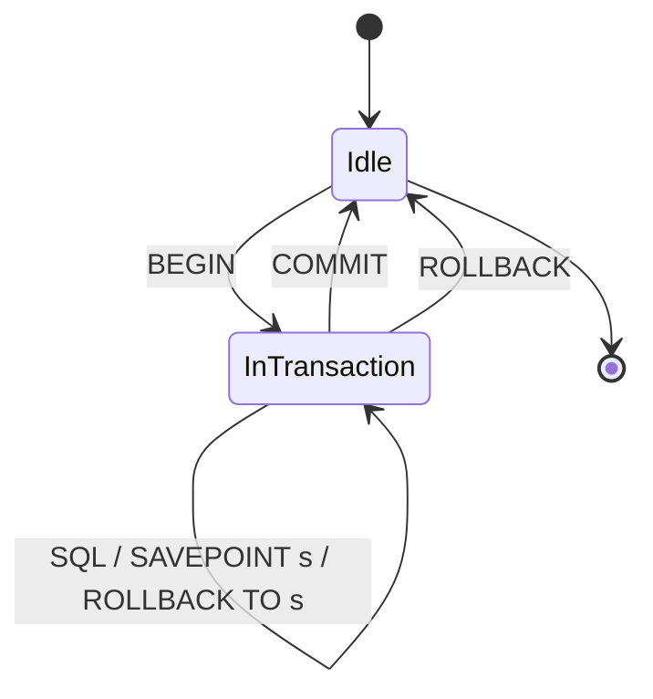
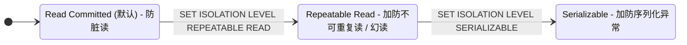
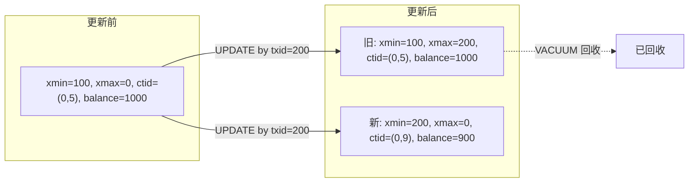
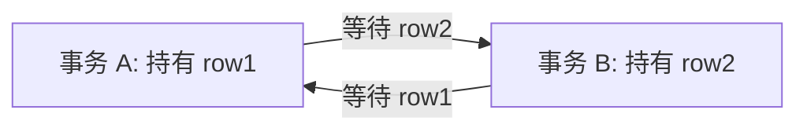

# 事务与并发

事务（transaction）是一组 SQL 语句的执行单位：要么全部生效、要么全部撤销。PG 用 **MVCC**（多版本并发控制）让读不阻塞写、写不阻塞读，再用**锁**保护互斥写入，用**隔离级别**控制并发事务之间能看见对方多少。本章覆盖 ACID 简述、事务控制语句、隔离级别声明、MVCC 系统列、锁的三种形态、死锁。

本模块在 `m_transaction` schema 下预置了一张 `accounts` 表：Alice 1000、Bob 1000、Carol 100、Dave 0，带 `balance >= 0` 检查约束，用来演示转账场景。

> **关于演示边界**：本课程的 `/exec` 端点已经把每个示例包在一个事务里跑完即提交，**单连接内无法同时开两个事务**。所以"脏读 / 不可重复读 / 幻读"这类**跨事务才看得到**的现象本章只在文字里讲，example 只演示**单事务内**可见的部分（SAVEPOINT、隔离级别声明、`SELECT ... FOR UPDATE`、咨询锁、xmin / xmax / ctid）。

## 1. ACID — 事务的四个属性

ACID 是事务的四个性质：**A**tomicity 全或全无、**C**onsistency 不破坏约束、**I**solation 并发互不干扰、**D**urability 提交后永久落盘。本章重点在 **I**（并发与隔离），其余三项 PG 默认就给你了——你的 SQL 跑在事务里就自动具备 A、C、D。

### 语法骨架

```text
A  Atomicity   全或全无：事务中所有语句一起生效或一起回滚
C  Consistency 不破坏约束：提交时必须满足所有 CHECK / UNIQUE / FK 等约束
I  Isolation   隔离：并发事务之间互相看不见对方的中间状态（强弱由隔离级别决定）
D  Durability  持久：COMMIT 返回后数据已写入 WAL，掉电不丢
```

- 本章只演示 A（用 SAVEPOINT + ROLLBACK TO 看「中间步骤撤销，最终结果不变」）和 I（声明隔离级别）
- C、D 由 PG 自动保证，无需 SQL 演示

:::example{id="acid-atomicity-demo"}

## 2. 事务控制 — BEGIN / COMMIT / ROLLBACK / SAVEPOINT

`BEGIN`（或 `START TRANSACTION`）开启一个事务，之后所有语句进入同一个事务上下文；`COMMIT` 提交全部更改，`ROLLBACK` 撤销全部更改。事务内可以用 `SAVEPOINT <name>` 设保存点，之后 `ROLLBACK TO <name>` 只撤销保存点之后的语句、保留之前的。本课程框架已为你包了一层事务，example 里**不要**手写 `BEGIN`/`COMMIT`，但 `SAVEPOINT` / `ROLLBACK TO` / `RELEASE SAVEPOINT` 可以正常用。

### 语法骨架

```text
BEGIN;                         -- 开启事务（START TRANSACTION 同义）
COMMIT;                        -- 提交全部更改
ROLLBACK;                      -- 撤销全部更改
SAVEPOINT <name>;              -- 在事务内设保存点
ROLLBACK TO <name>;            -- 撤销到保存点（保存点之前的更改保留）
RELEASE SAVEPOINT <name>;      -- 丢弃保存点（更改保留，仅去掉这个名字）
```

- `<name>`：保存点名，事务内唯一；同名后设的覆盖前面的
- `ROLLBACK TO` 不结束事务，可继续在同一事务内执行新语句
- `RELEASE SAVEPOINT` 只是清掉这个名字；它之后的更改仍在事务里



:::example{id="savepoint-rollback-to"}

:::example{id="savepoint-release"}

## 3. 隔离级别 — 控制并发事务能看见对方多少

SQL 标准定义 4 个隔离级别：Read Uncommitted、Read Committed、Repeatable Read、Serializable，从弱到强逐级防住更多并发异常。PG 实际只实现 3 个——把 Read Uncommitted 等同于 Read Committed（PG 的 MVCC 从不读未提交版本）。默认是 **Read Committed**。级别越高，并发异常越少，但开销越大（Serializable 在冲突时会让事务失败重试）。

### 语法骨架

```text
SET TRANSACTION ISOLATION LEVEL <level>;
-- 或会话级：
SET default_transaction_isolation = '<level>';

<level> ::= READ COMMITTED / REPEATABLE READ / SERIALIZABLE

异常对照表（&#10003; = 该级别会阻止）：
                       脏读     不可重复读   幻读     序列化异常
  READ COMMITTED       &#10003;    no          no       no
  REPEATABLE READ      &#10003;    &#10003;     &#10003;  no
  SERIALIZABLE         &#10003;    &#10003;     &#10003;  &#10003;
```

- `<level>`：三选一；`SET TRANSACTION` 仅对当前事务生效
- PG 的 REPEATABLE READ 已经能防住幻读（标准只要求 SERIALIZABLE 防）
- **跨事务异常需要 2 个连接才看得到**，本课程框架内只演示「如何声明」，不演示「异常本身」



:::example{id="show-default-isolation"}

:::example{id="set-isolation-repeatable-read"}

## 4. MVCC — 多版本并发控制

PG 用 MVCC 让读不阻塞写、写不阻塞读：每行物理上可同时存在多个版本，每个事务有自己的「快照」决定能看到哪些版本。每行带两个系统列：`xmin` 是创建该版本的事务 ID、`xmax` 是删除该版本的事务 ID（0 表示尚未删除）；`ctid` 是行的物理位置 `(block, offset)`。`UPDATE` 不是原地改值——它把旧版本的 `xmax` 标成当前事务 ID，再插入一个新版本，所以更新后同一行的 `ctid` 会变。旧版本由后续 `VACUUM` 回收（详见 ch18）。

### 语法骨架

```text
SELECT xmin, xmax, ctid, <columns>
FROM <table>
WHERE <predicate>;

-- UPDATE 前后同一逻辑行的系统列变化示意：
-- 更新前：(xmin=100, xmax=0, ctid=(0,5)) → balance=1000
-- 更新后：(xmin=200, xmax=0, ctid=(0,9)) → balance=900
--        旧版本 (xmin=100, xmax=200, ctid=(0,5)) 暂留，等 VACUUM 回收
```

- `xmin`：创建该版本的事务 ID（txid）
- `xmax`：删除该版本的事务 ID；0 / `null` 表示该版本仍是「最新」
- `ctid`：物理位置 `(block_number, item_offset)`，每次 UPDATE 都会变



:::example{id="mvcc-inspect-xmin"}

:::example{id="mvcc-update-creates-new-version"}

## 5. 锁 — 行锁 / 表锁 / 咨询锁

PG 有三类锁：**行锁**保护单行，DML 自动加（`UPDATE` / `DELETE` 自动锁住目标行），也可显式 `SELECT ... FOR UPDATE`；**表锁**保护整张表，DDL 自动加最强的 `ACCESS EXCLUSIVE`，也可显式 `LOCK TABLE` 指定模式；**咨询锁**（advisory lock）不绑表，用一个用户自定义的整数 ID 充当互斥量，业务自定义场景用，常见用法是「同一时间只允许一个 worker 跑某任务」。所有锁在事务结束（COMMIT/ROLLBACK）时自动释放——咨询锁分会话级 `pg_advisory_lock` 和事务级 `pg_advisory_xact_lock`，前者要显式 `pg_advisory_unlock` 释放。

### 语法骨架

```text
-- 行锁：在事务内独占目标行直到事务结束
SELECT ... FROM <table> WHERE <predicate> FOR UPDATE;

-- 表锁：显式锁住整张表，<mode> 决定与哪些操作冲突
LOCK TABLE <table> IN <mode> MODE;
-- <mode>: ACCESS SHARE / ROW SHARE / ROW EXCLUSIVE / SHARE / EXCLUSIVE / ACCESS EXCLUSIVE

-- 咨询锁：用一个整数 ID 当用户级互斥量
SELECT pg_advisory_lock(<id>);          -- 会话级，要 unlock 释放
SELECT pg_advisory_unlock(<id>);
SELECT pg_advisory_xact_lock(<id>);     -- 事务级，事务结束自动释放
```

- `<predicate>`：常用主键等值，把锁限定到具体行
- `<mode>`：表锁模式，强度从弱到强；`ACCESS EXCLUSIVE` 与所有读写冲突
- `<id>`：64 位整数（或两个 32 位整数对），含义由业务定义；PG 不解读

:::example{id="row-lock-for-update"}

:::example{id="advisory-lock-acquire-release"}

:::example{id="inspect-pg-locks"}

## 6. 死锁 — 循环等待与自动检测

死锁是两个（或多个）事务**相互等对方持有的锁**：A 持有行 1 等行 2、B 持有行 2 等行 1，谁也不肯松手。PG 后台有死锁检测器，超过 `deadlock_timeout`（默认 1s）后扫一遍等待图，发现环就**杀掉其中一个事务**（错误码 `40P01`，`deadlock_detected`），让另一个继续。业务上避免死锁的标准手段是「**所有事务按固定顺序加锁**」，例如转账永远先锁 id 较小的账户。本节只解释机制，不演示——演示死锁需要 2 个连接。

### 语法骨架

```text
事务 A：              事务 B：
  BEGIN;                BEGIN;
  锁住行 1              锁住行 2
  请求锁行 2 (等)       请求锁行 1 (等)
                        ── 形成环 ──
  PG 检测到环：杀掉 A 或 B（错误码 40P01）
```

- `deadlock_timeout`：等待多久之后才触发检测；过短会浪费 CPU 扫等待图
- 避免死锁的工程做法：固定加锁顺序、缩短事务、避免事务内做长查询



:::example{id="deadlock-timeout-setting"}
