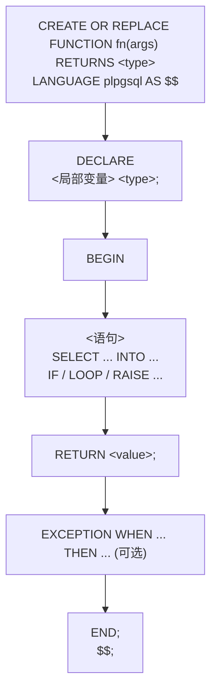
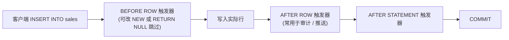

# 视图与函数

视图、物化视图、函数、触发器、事件触发器都是 PG 把「查询逻辑」存到数据库里的方式。本章在 `m_view_function` schema 下预置了一张 `sales` 表（30 行、3 region × 5 product）、一份普通视图 `v_region_total`、一份物化视图 `mv_region_total`、一个 PL/pgSQL 函数 `fn_region_total`、一张审计表 `sales_audit` 与配套的 BEFORE INSERT 触发器。

## 1. 普通视图

普通视图是一个**命名的 SELECT**，本身不存数据——每次查它，PG 都按定义重新执行底层 SELECT。它用来给复杂查询起个名字、复用、隐藏底表细节。视图的定义可以用 `CREATE OR REPLACE VIEW` 重写，但**列结构必须保持兼容**（同名、同类型、同顺序，可在末尾追加列）。

### 语法骨架

```text
CREATE [OR REPLACE] VIEW <name> AS
  SELECT ...;

DROP VIEW [IF EXISTS] <name>;
```

- `<name>`：视图名，schema 内唯一
- `OR REPLACE`：已存在时改定义，**不允许改列结构**（同名、同类型、同顺序）
- `AS SELECT ...`：视图背后的查询，任何合法 SELECT 都行（含 JOIN、聚合、CTE）
- `DROP VIEW`：删除视图，不影响底表数据

:::example{id="view-select"}

:::example{id="view-replace"}

:::example{id="view-drop-recreate"}

## 2. 物化视图

物化视图（materialized view）存的是**执行后的结果集**，像一张"缓存表"：查它不重算，写它要靠 `REFRESH MATERIALIZED VIEW` 重跑底层 SELECT。它适合「代价高但不需要实时」的聚合，比如每天刷一次的报表。`REFRESH ... CONCURRENTLY` 不阻塞读，但要求物化视图上有一个 UNIQUE 索引。

### 语法骨架

```text
CREATE MATERIALIZED VIEW [IF NOT EXISTS] <name> AS
  SELECT ...;

REFRESH MATERIALIZED VIEW [CONCURRENTLY] <name>;

DROP MATERIALIZED VIEW [IF EXISTS] <name>;
```

- `<name>`：物化视图名，schema 内唯一
- `IF NOT EXISTS`：已存在则跳过
- `REFRESH`：重跑底层 SELECT，覆盖结果集；默认会锁住读
- `CONCURRENTLY`：不阻塞读，但要求物化视图上有 UNIQUE 索引
- `DROP MATERIALIZED VIEW`：删除物化视图与其存的结果集

:::example{id="mv-select"}

:::example{id="mv-refresh"}

:::example{id="mv-refresh-concurrently"}

## 3. 函数（PL/pgSQL）

PG 支持多种过程语言写函数，**PL/pgSQL** 是默认安装的那一种，写起来像 PL/SQL：有 `DECLARE` 声明局部变量、`BEGIN ... END` 包函数体、可写 `IF / LOOP / RAISE` 等控制流。函数用 `CREATE OR REPLACE FUNCTION` 定义，用 `SELECT fn(...)` 调用。函数体是字符串，用 `$$ ... $$` dollar-quoting 写更省心。

### 语法骨架



- `fn(args)`：函数名 + 参数列表，调用时 `SELECT fn(...)`
- `RETURNS <type>`：返回类型，标量 / 复合 / `SETOF` / `void`
- `LANGUAGE plpgsql`：选 PL/pgSQL，PG 还支持 PL/Tcl、PL/Perl、PL/Python 等
- `DECLARE`：局部变量声明区，无变量时整段省略
- `$$ ... $$`：dollar-quoting，省得给函数体里的引号转义
- `EXCEPTION`：可选异常处理区，捕获 `unique_violation` 等

:::example{id="fn-call"}

:::example{id="fn-define-inline"}

:::example{id="fn-inspect-source"}

## 4. 触发器

触发器是**绑在某张表上**、在指定事件发生时**自动调用**的函数。事件是 `INSERT / UPDATE / DELETE / TRUNCATE`，时机是 `BEFORE / AFTER / INSTEAD OF`，粒度是 `FOR EACH ROW`（行级）或 `FOR EACH STATEMENT`（语句级）。触发器函数返回类型必须是 `trigger`，行级触发里通过 `NEW`（新行）/ `OLD`（旧行）拿到当前行。

### 语法骨架

```text
CREATE TRIGGER <name>
  { BEFORE | AFTER | INSTEAD OF } { INSERT | UPDATE | DELETE | TRUNCATE }
  ON <table>
  FOR EACH { ROW | STATEMENT }
  EXECUTE FUNCTION <fn-name>();

DROP TRIGGER [IF EXISTS] <name> ON <table>;
```

- `<name>`：触发器名，**表内唯一**（同库不同表可重名）
- `BEFORE / AFTER / INSTEAD OF`：相对事件的时机；`INSTEAD OF` 只能用在视图上
- `FOR EACH ROW / STATEMENT`：每行触发一次 / 整条语句触发一次
- `EXECUTE FUNCTION <fn-name>()`：调用的触发器函数，必须返回 `trigger`



:::example{id="trigger-audit-on-insert"}

:::example{id="trigger-inspect"}

## 5. 事件触发器

事件触发器是 **DDL 级**的触发器：不绑定具体表，而是绑定库内所有的 DDL 事件，常用事件是 `ddl_command_start`、`ddl_command_end`、`sql_drop`、`table_rewrite`。用途是审计 schema 变更、阻止误删等。创建事件触发器需要 superuser，普通教学环境用得少，本节只点到为止。

### 语法骨架

```text
CREATE EVENT TRIGGER <name>
  ON { ddl_command_start | ddl_command_end | sql_drop | table_rewrite }
  EXECUTE FUNCTION <fn-name>();

DROP EVENT TRIGGER [IF EXISTS] <name>;
```

- `<name>`：事件触发器名，库级唯一（不属于任何 schema）
- `ON <event>`：监听哪类 DDL 事件
- `EXECUTE FUNCTION <fn-name>()`：调用的函数，返回 `event_trigger`
- 创建 / 删除事件触发器需要 superuser

:::example{id="event-trigger-list"}
